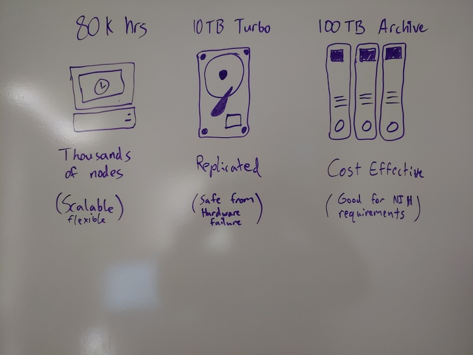
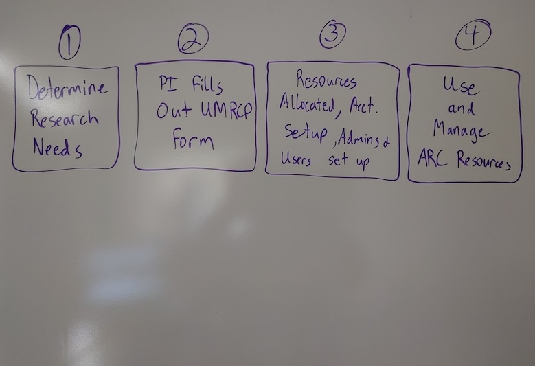
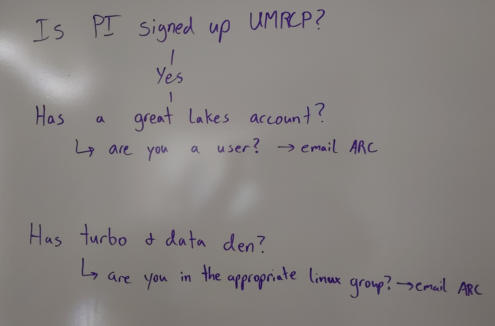

In this module, we will:

* discuss reproducible computing in general
* discuss storage best practices for raw data, anlaysis files, scripts, etc.
* learn about the UMRCP and how to request it
* make a plan for enrolling PIs in UMRCP and enabling access to all researchers

## Reproducible Computing

Reproducible computing has become incredibly important as computing has become more and more intertwined with research endeavors. In recent times, it has become absolutely necessary for publication. In many cases, in order to credibly validate an analysis, we must be able to not only see and understand the steps of an analysis, but also to be able to do these same manipulations ourselves.

There are a number of tools and techniques that have emerged in this space, which when utilized will transform any analysis into one that is reproducible. 

In this workshop we'll discuss these tools and techniques, we'll provide specific guidance for University of Michigan researchers to address reproducibility concerns, and we'll use practical examples along the way to gain experience with the concepts that we've learned.

## Storage Best Practices

Project Organization - documentation! separate dir for scripts, for outputs

Separate location for raw data

Fast storage for analysis

## Storage Options for UMich Researchers

We've discussed best practices for data, analysis intermediates and scripts, etc. in general terms, but now we'll have the opportunity to revisit these ideas while highlighting specific options and recommendations for UMich researchers. By the end of this module, we will understand our numerous storage options available to us. Looking forward to future modules, we'll also run exercises that interact with some of these storage allocations as we proceed, including Data Den and its unique characteristics and usage patterns.

### What is ARC?

The vast majority of computing resources we'll be discussing in the workshop are provided and managed by ARC - Advanced Research Computing at University of Michigan. The shared computing cluster that we'll be using in the workshop is run by ARC, and the storage allocations likewise are provided by ARC. Their mission is to provide university researchers with the advanced computing resources that they need, and they've been working with research groups in various compute intensive fields to achieve this. 

Later on we'll discuss in detail how to request resources through ARC, but for now we'll focus on the storage topic and cover some important storage options that ARC provides

### Data Den

Data Den is a low-cost, highly durable storage system operated by ARC.

Tape-based archival storage. The largest and cheapest storage available through ARC.

Generally can only access this indirectly i.e. use Globus to interface with this storage. Due to its architecture, slow read speeds, and need to eliminate write operations and unnecessary read operations.

### Turbo

Turbo is a high-capacity, reliable, and fast storage system operated by ARC.

It is tuned for files moderate to large in size, but can also easily accomodate small files as well.

Can be accessed through the High-Performance Computing (HPC) cluster.

Fast storage like Turbo is well-equipped for computing direcly from the disk. Turbo supports fast read/write times, and is an excellent place to perform analyses.

### Metaphor w/ Turbo & Data Den

### Home, Scratch, tmp, and others

- Home directory (80 GB quota)
  - /home/uniqname
- Scratch directory (10 TB and 10,000,000 FIXME?? file quota)
  - /scratch/account_root/account/uniqname
  - Not persistent across time
- Local disk (4 TB shared)
  - /tmp
  - Not persistent across machines

## UMRCP

The figure above highlights the most important and impressive details of the UMRCP, but you can find full details of the resources offered through this program on [the UMRCP page of ARC's website](https://arc.umich.edu/umrcp/).

### Signing up for the UMRCP

Within that site, there is another page that I highly recommend as a great place to start - the [UMRCP Requesting Resources Guide](https://arc.umich.edu/umrcp-requesting-resources-guide/). There you'll find details about the signup process. After signing up, you'll be able to use some of the thousands of compute nodes available through ARC, as well as the various storage tiers described above.

 

 

Main ideas:
 - PI must be the one to fill out form
 - PI will automatically become an administrator
 - Others can become administrators (lab manager) or members

 Distinguish between administrators and users - admins should be long-term members of the lab, can change allocations, add storage, add/remove users, etc.

 |              | Change Allocations | Add/Remove Users | Use GL compute time | Read/Write access to Turbo | Globus Admin? |
| ------------ | ------------------ | ---------------- | ------------------- | -------------------------- | ------------- |
| PI           | X                  | X                | ~                   | ~                          | X             |
| Lab Manager  | X                  | X                | X                   | X                          | X             |
| Grad Student |                    |                  | X                   | X                          |               |

 

FIXME: Use checkmarks instead of X, maybe add a legend

## Exercise: Log in to Great Lakes and run Hello World

Following along with instructor, we will get everyone logged in to Great Lakes, and run a Hello World script. We'll also take some time to look around at some of the above mentioned storage locations.

## Exercise: Make a Game Plan for UMRCP

Conduct polling to determine need for UMRCP enrollment by audience & their PIs.

Discuss scenarios if they already have HPC access **not** through the UMRCP but through other mechanism. Game plan for those folks.

Discuss scenario where they don't have HPC access and not enrolled in UMRCP. Game plan for those folks.

 

 

 

| [Back to Introduction](Module00_Introduction.html) | [Top of this lesson](#top) | [Next lesson](Module FIXME .html) |
| :--- | :----: | ---: |
