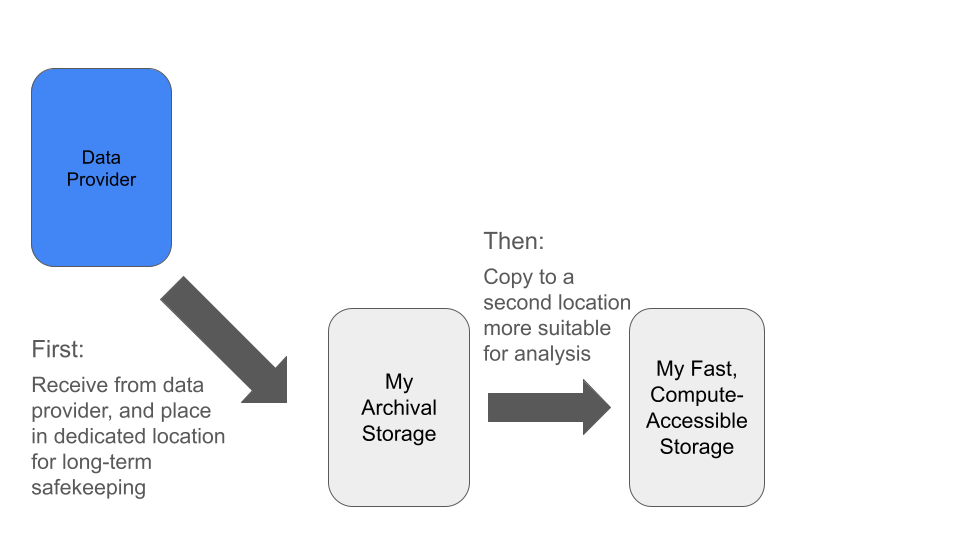
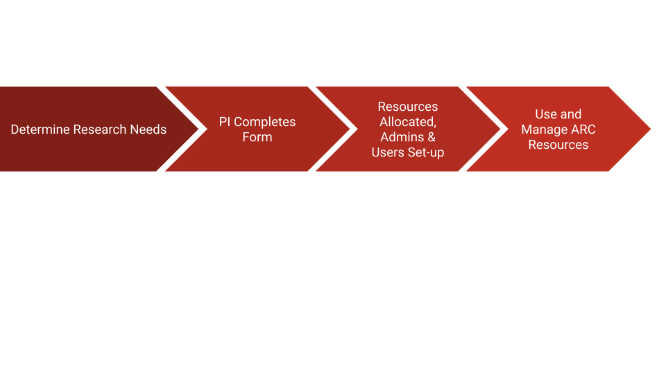

In this module, we will:

* discuss reproducible computing in general
* discuss storage best practices for raw data, anlaysis files, scripts, etc.
* learn about several institutional storage options (and associated compute resources)
* learn about the UMRCP and how to request it
* make a plan for enrolling PIs in UMRCP and enabling access to all researchers

 

## Reproducible Computing

Reproducible computing has become increasingly important in recent years. As experimental data volumes have increased exponentially, and as research endeavors have employed more complicated analyses over time, computation has become a fundamental aspect of virtually every type of research.

Reproducibility itself is an integral part of the scientific process. We describe our experiments with sufficient detail so that they can be replicated and our findings can be confirmed by others, and so that eventually others may build upon them.

So taking these two things together, the increasing use of computing in research and the inherent need for reproducibility in the scientific process, we can start to understand the importance of reproducible computing.

There are some challenges we must overcome in this realm. When we try to employ our typical methodologies for general scientific reproducibility, they may not be sufficient to truly enable others to recreate our work. In many cases, in order to credibly validate an analysis, we must be able to not only see and understand the steps of an analysis, but also to use the same software with the same input data and perform these same data manipulations ourselves. Trying to achieve this task with only a descriptive summary of our analysis methods, particularly when using cutting-edge academic software, may often produce little more than frustration.

Let's take a moment to think about our own experiences with this topic. Can we think of experiences where we encountered challenges while trying to reproduce the analysis of others? Or while trying to share our own analyses with colleagues?

There are a number of tools and techniques that have emerged to address some of these challenges, and to really lower the barrier to sharing and reproducing our results.

In this workshop we'll discuss these tools and techniques, we'll provide specific guidance for University of Michigan researchers to address reproducibility concerns, and we'll use practical examples along the way to gain experience and emphasize the concepts that we learn.

 

## Storage Best Practices

One simple way to organize our thinking about storage best practices is to divide the topic into raw data considerations, and considerations for analysis projects. By separating and focusing on those two aspects, we can effectively address many of the challenges associated with each.

>Note: The importance of documentation is universal to all aspects of reproducible research. In considering best practices both for our raw data and for our analysis projects, we will emphasize the importance of documentation!

### A Generalized Data Flow

### Raw Data

When considering best practices for raw data storage, we can generally orient ourselves around one task - ensure that the data are safe.

Safe from:

- Accidental deletion
- Hardware failure
- Loss of access

With this in mind, we recommend placing your raw experimental data into a specific designated location which is **solely** dedicated to storing your raw data.

Soon we'll talk about specific options for UMich researchers, but for now we'll just speak of the general process. Data that cannot easily be re-obtained should be treated with great care. By following the recommendations here, we can achieve this and have peace of mind that we are preserving our raw data and our capabilities for reproducible research well into the future.

Recommended:

- Designated location for storing raw data
- Limit write access of stored data files
- Use institutional storage
  - Large file sizes and large total allocations
  - Long-term support
  - Hardware redundancy
  - Location redundancy

Another thing to mention for raw data best practices is the procedure of checking file integrity. Whenever transferring data from one storage location to another, and especially while doing so over a network connection, it is good practice to follow up with a file integrity check. Briefly, we use software to inspect our files and determine if any of the contents have changed. In a later module we'll have a chance to try this ourselves, using the `md5sum` utility. This is a relatively efficient way of verifying file integrity after a file transfer.

### Analysis Projects

We can begin thinking of our next task - handling data and organizing files and artifacts for our analysis - by starting with the idea of the data flow described above. One of the first tasks in this area is to set up a new location for your analysis and make a copy of your raw data there.

Some considerations:

 - Fast storage, well suited for computation
 - Project organization that facilitates reproducibility
 - In-progress analyses, cleanup procedures, and end-to-end repeatable analyses

When we think about fast storage that is well suited for computation, we mostly contrast that with our long-term archival storage. A storage option is well suited for computation if it is accessible via high-throughput connection to sufficiently powerful processing hardware. The speed of reading and writing from this location can greatly affect processing times of your analysis, depending on the steps involved.

In terms of project organization, generally we want to have distinct locations for specific purposes, and preferably organizing things in a consistent manner for all of our projects.

In a particular project, you may want:

- `input_data` directory for copy of raw data
- `scripts` directory for analysis scripts
- Directories for intermediates, log files, and final outputs
- `README.txt` for the project
  - Optional `docs` directory for extensive documentation, supporting works, etc.

A useful idea for our project directory layouts is to think about the project life cycle and work towards an end-goal of a reproducible analysis. While at the beginning of an analysis many things may be flexible, at the end we will want to be able to re-execute the analysis starting from the raw input data and running all the way until it produces the final outputs.

Taking time to segregate specific efforts within a project, documenting our steps as we perform in-progress analyses, performing cleanups where needed, and similar efforts will aid us as we work towards that goal.

Think ahead when designing the layout of your projects. If you will be trying several related analysis approaches using the same input data, but intend on using results from only one of the evaluated methods, it may make sense to intentionally subdivide the contents of your project directory accordingly. If you have several distinct analyses that may use the same input data, then perhaps creating separate projects for each of them will make the most sense. It's hard to be totally prescriptive when making recommendations here, but through our example we hope to spark the kinds of conversations and the types of thinking that are required here.

One last note on handling and organizing analysis projects - use some form of identification system for projects in your lab. This simplifies communication and record keeping, in addition to the organizational benefits.

Some ideas for project identification systems:

- Codenames
- Alphanumeric IDs

 

## Storage Options for UMich Researchers

We've discussed best practices for data, analysis intermediates and scripts, etc. in general terms, but now we'll have the opportunity to revisit these ideas while highlighting specific options and recommendations for UMich researchers. By the end of this module, we will understand our numerous storage options available to us. Looking forward to future modules, we'll also run exercises that interact with some of these storage allocations as we proceed, including Data Den and its unique characteristics and usage patterns.

### What is ARC?

The vast majority of computing resources we'll be discussing in the workshop are provided and managed by ARC - Advanced Research Computing at University of Michigan. The shared computing cluster that we'll be using in the workshop is run by ARC, and the storage allocations likewise are provided by ARC. Their mission is to provide university researchers with the advanced computing resources that they need, and they've been working with research groups in various compute intensive fields to achieve this. 

Later in this module we'll discuss in detail how to request resources through ARC, but for now we'll focus on the storage topic and cover some important storage options that ARC provides.

### Data Den

Data Den is a low-cost, highly durable storage system operated by ARC.

- Tape-based archival storage
- The largest and most affordable storage available through ARC.
- Can only access this indirectly
  - i.e. use Globus to interface with this storage. 
  
<!-- Due to its architecture, slow speeds, and need to eliminate unnecessary read/write operations -->

> Note: Data Den has a file size limitation - it does not handle large amounts of small files. Optimal file size is in the multi-gigabyte range.
> The limitation 10,000 files per TB of storage.

### Turbo

Turbo is a high-capacity, reliable, and fast storage system operated by ARC. It is more costly than Data Den.

- More costly than Data Den
- Tuned for files moderate to large in size, but can also easily accomodate small files
- Can be accessed through the High-Performance Computing (HPC) cluster

Fast storage like Turbo is well-equipped for computing direcly from it. Turbo supports fast read/write times, and is an excellent place to perform analyses.

### Turbo and Data Den - Cost Difference

We discussed above that Data Den is slow, unsuited for analysis, yet cost-effective, while Turbo is fast, well-tuned for analysis, and more costly. To put some numbers to this price discussion, see the following table of cost per TB per year:

|          | Unreplicated | Replicated |
| --------:| -----------------------:| ----------:|
| Turbo    | $77.88                  | $156.22    |
| Data Den | NA                      | $20.04     |

Notice that Turbo storage is about 8x more costly than Data Den for the same amount of replicated storage.

>Note: Data Den is only available in the replicated format.

### Home, Scratch, tmp, and others

- Home directory (80 GB quota)
  - /home/uniqname
- Scratch directory (10 TB and 1,000,000 file quota)
  - /scratch/account_root/account/uniqname
  - Not persistent over time
    - Automatically deleted if not accessed in 60 days
- Local disk (4 TB shared)
  - /tmp
  - Not persistent across machines

### Institutional Storage vs Other Storage

| Institutional   | Other                             |
| --------------- | --------------------------------- |
| Turbo           | Laptop Storage                    |
| Data Den        | Storage on a Shared Lab Computer  |
| Home / Scratch* | Portable Hard Drive / Flash Drive |
| MiStorage       | Cloud Storage                     |

 

## UMRCP

The figure above highlights the most important and impressive details of the UMRCP, but you can find full details of the resources offered through this program on [the UMRCP page of ARC's website](https://arc.umich.edu/umrcp/).

### Signing up for the UMRCP

Within that site, there is another page that I highly recommend as a great place to start - the [UMRCP Requesting Resources Guide](https://arc.umich.edu/umrcp-requesting-resources-guide/). There you'll find details about the signup process. After signing up, you'll be able to use some of the numerous compute nodes available through ARC, as well as the various storage tiers described above.

 

 

Additional Resources Available Through HITS RCI

In addition to the resources provided through the UMRCP, some researchers within the medical system will have additonal resources available through UM Health Information Technology & Services (HITS). Through strategic investments in High Performance Computing by Michigan Medicine, eligible researchers can enjoy additional allocations for the described resources - most notably unlimited Data Den storage.

In the documentation for the UMRCP and the UMRCI, you'll see that they recommend first using the UMRCP resources (available to all university researchers) and then transitioning to these additional HITS UMRCI resources (available to Michigan Medicine researchers) when possible. In any case, since these allocations are managed by ARC for all univerisity researchers - Michigan Medicne or otherwise - you'll be using the same forms and procedures to request resources and use them. However, the billing details may change depending on this eligibility.

[Link to HITS page on UMRCI](https://hits.medicine.umich.edu/research-education/research-computing-data-storage/research-computing-package)

 

### Great Lakes, Armis2, and Lighthouse Clusters

This module overall is primarily focused on storage-related topics. We've briefly mentioned that in addition to storage resources, ARC also provides access to high-performance computing (HPC) hardware as well. While in this workshop we'll just be focusing on one of them, in fact there are several HPC clusters that are available to UMich researchers, in order to meet various needs.

When discussing research needs, especially in anticipation of requesting UMRCP resources and filling out the required form, we should discuss a little bit about three HPC options provided through ARC:

- Great Lakes
- Armis2 (HIPAA-aligned)
- Lighthouse (Researcher-owned hardware)

We'll be discussing Great Lakes at length throughout this workshop and using it for our example analyses. We can think of it as a general-purpose HPC cluster, which is suitable for many different kinds of research.

Armis2 is similar in feel to the Great Lakes cluster, except it is configured with specific security measures in place to enable analysis of sensitive data, such as export-controlled or HIPAA protected data.  When filling out the UMRCP form, you can make selections for sensitive data needs, which will provide CPU hours on Armis2 and associated storage. We'll see later, that we have flexibility in how we allocate resources between e.g. Great Lakes and Armis2.

>Note: There is a separate, security-enhanced Turbo allocation that is also HIPAA aligned that should be used with Armis2.

Lighthouse is also similar in feel to the Great Lakes cluster, except it is a cluster comprised entirely of researcher-owned hardware. Contrasting this with Great Lakes where we are only responsible for the cost of the resources we use, on Lighthouse, a researcher will fund the entirety of the hardware and receive 100% of its availability. This can be a good choice for researchers who are expected to have near-constant compute usage needs, or who require instant availability of HPC resources.

 

Main ideas:

 - PI must be the one to fill out form
 - PI will automatically become an administrator
 - Others can become administrators (lab manager) or members

 

### Administrators vs Users

|              | Change Allocations | Add/Remove Users | Use GL compute time | Read/Write access to Turbo | Globus Admin |
| ------------ | ------------------ | ---------------- | ------------------- | -------------------------- | ------------- |
| PI           | ✅                  | ✅                | ⏳                   | ⏳                          | ✅             |
| Lab Manager  | ✅                  | ✅                | ⏳                   | ✅                          | ✅             |
| Grad Student |                    |                  | ✅                   | ✅                          |               |

> Legend:
>
> ✅ = Frequent
>
> ⏳ = Occasional

 

### Resource Management Portal

A key part of how we will manage our ARC resources is through their Resource Management Portal, shown here. 

This portal can be found at [https://portal.arc.umich.edu](https://portal.arc.umich.edu).

Let's not go there just yet, but discuss what we see in this screenshot, and then move on to the exercise. We'll learn about some of the differences that we may see depending on our current status and existing resources, and we'll learn that there are some differences in the best way to request UMRCP resources depending on these details.

 

## Exercise: Make a Game Plan for UMRCP

In this exercise we will determine the needs for UMRCP enrollment by audience & their PIs.

There are two video links below. There's a decent amount of overlap in the content, and the main ideas are pretty similar. In either case, we will be filling out the UMRCP web forms as shown in the videos. Depending on our current status though, we may have different optimal starting points and different things to consider.

 

[UMRCP How to Enroll - New to ARC Services](https://www.mivideo.it.umich.edu/media/t/1_i8j5pujz/181860561)

 

[UMRCP How to Enroll - Existing Owner of ARC Services](https://www.mivideo.it.umich.edu/media/t/1_znf6ygk0/181860561)

 
 

| [Previous lesson](Module01_Warming_Up.html) | [Top of this lesson](#top) | [Next lesson](Module02_transferring_data_globus.html) |
| :--- | :----: | ---: |
