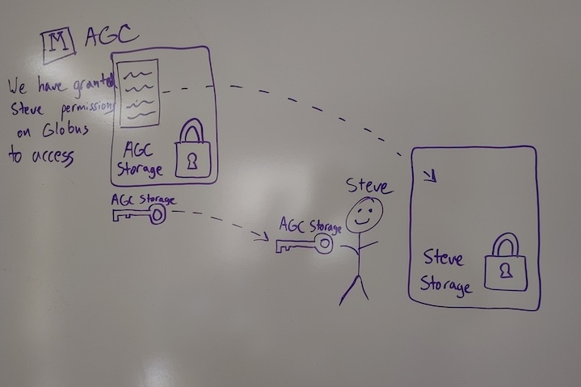
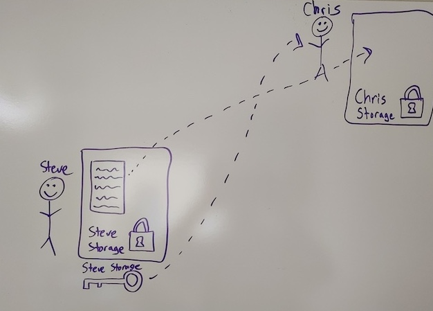

In this module, we will:

* review storage best practices and relate them to real situations
* learn about the data transfer tool Globus
* gain real experience using Globus in various ways

## Relating Data Transfer to Storage Best Practices with Typical Examples

 - I need to retrieve raw data from a data provider, and keep it in a safe place
 - I need to copy my raw data into a new location, to perform an analysis
 - I need to share my raw data and my analysis with a collaborator

## Data Transfer

As you can see, data transfer itself is an important consideration that goes hand in hand with our storage best practices described in the previous module. Ensuring that data is transmitted and received intact, and understanding the movement and placement of data during your research life cycle is a very important aspect of reproducible computing.

## Globus

For the data transfer portion of this workshop, we'll focus on a software solution called Globus. Globus allows the transfer of data between different storage systems, and it's designed particularly for transferring research data. Many universities and institutions, including the University of Michigan, are using Globus in this way.

FIXME: Pre-emptively address question: Dropbox vs Globus??
Imagine a comparative table Dropbox vs Globus. Globus is strictly transfer & dropbox also offers cloud storage.

The standard features of Globus include:
- Transfers faster than SCP/SFTP (usually by a factor of two)
- Automatic restarts or continuation when transfers are disrupted
- Background transfers so users need not remain logged in to a system
- Transfers of large files between your laptop/desktop and servers via Global Connect Personal
- Transfer of small number of small files between your laptop/desktop via a browser (note: not all server endpoints offer this feature)

U-M’s Globus Provider status adds the following features:
- Sharing of server directories/folders with non-U-M collaborators who are also Globus users (for transfer/copy purposes, not shared use of server)
- U-M signed BAA for High Assurance feature for sensitive data
- Sharing of directories/folders from laptops/desktops via Globus Connect Personal clients and a Globus Plus account upgrade.

## Exercise Transferring Data from Data Provider to My Data Den

## Exercise Transferring Data from Data Provider to My Turbo

## Exercise Sharing Data With a Collaborator

 
 

## Review Main Points

Must understand where the data currently resides, and where you want to transfer it

Must understand who is responsible for performing the transfer

Unless this is arranged previously for an ongoing relationship, *someone* will *always* need to grant permissions to enable the transfer

## FIXME - have another independent exercise (on Great Lakes)

## FIXME - Slack thread asking for more scenarios of data transfer tasks

| [Back to Introduction](Module00_Introduction.html) | [Top of this lesson](#top) | [Next lesson](Module FIXME .html) |
| :--- | :----: | ---: |
