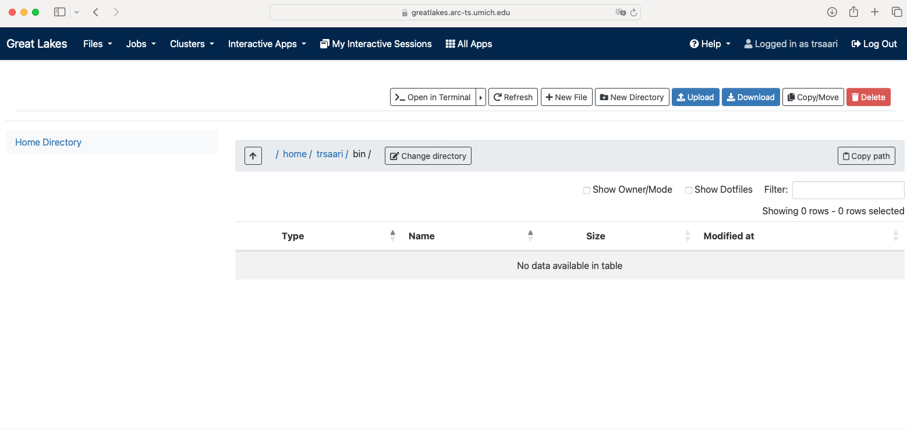

In this module, we will:

* take an introductory look at the Great Lakes HPC cluster
* discuss the need for requesting compute resources
* learn about several ways to access Great Lakes
* use the web-based file browser for Great Lakes
* introduce or review the nano text editor
* use the OpenOnDemand service to launch a web-based interactive job

## Great Lakes - Sneak Peek

[Link to Great Lakes Dashboard](https://greatlakes.arc-ts.umich.edu)

### Using an HPC Cluster - Must Request Resources

When using an hpc cluster, there is a pattern that is quite different from our typical interactions with a computer system - we must ask for resources before we are able to use them. This is a characteristic of a shared, large, multi-user system like Great Lakes. Within the entirety of the system, we have an enormous amount of computing power, but at the same time, we need to allow equal access to this resource to the entirety of the University. Therefore, we use this pattern of requesting resources and receiving them before we begin our computing tasks.

### Several ways to access Great Lakes

- For compute access:
    - Secure Shell (ssh)
    - Web-based shell
    - OpenOnDemand interactive apps (e.g. RStudio, Basic Desktop)
- For file access:
    - Globus
    - Direct (Storage is mounted on Great Lakes)
    - Remote mount (Storage is mounted on your workstation)
    - `scp`, `rsync`, etc.

## Using the web-based access methods

The web-based tools that provide access to Great Lakes and other ARC resources are a quick and easy way to get started. We'll use these in our upcoming exercises to make our first foray into using the Great Lakes HPC. Additionally, the 'Interactive Apps' with ARC's Open On Demand service offer a unique solution for when we need to run graphical applications. We'll preview this and give some practical tips for using the RStudio and the Basic Desktop apps.

Sneak preview of the web-based file browser

Sneak preview of the web-based shell

Sneak preview of a web-based RStudio session

<!-- FIXME: Add preview of web-based Basic Desktop session -->

## Quick Review or Crash Course on the Nano Editor

Before we dive into some of the exercises in this module, we should do a quick review or crash course on the nano text editor, which is a command-line-based text editor. In some of the upcoming exercises, we will be connected to Great Lakes via the web-based shell, which means that we will be limited to using command-line tools. During that time, we'll use nano to edit READMEs and script files. Nano, along with other command-line-based text editor tools, use the keyboard as the main way of interfacing with the software. This means we will use various keystrokes to carry out tasks like saving the file and exiting the tool, which may take some practice to get comfortable with. Thankfully, nano is relatively intuitive and easy to use, which is one reason why we've chosen to use it for this workshop.

The basic layout of the nano editor is shown below. A helpful list of common tasks and their keyboard shortcuts is found at the bottom. The title bar and the status bar provide some additional context about the file we're interacting with and feedback messages from nano, respectively.

## Exercise - View Transferred Files

Following along with the instructor, we'll use the web-based file browser to confirm that we've transferred the data files to our turbo space

## Exercise - Connect with the Web-Based Shell

Following along with the instructor, we'll use the web-based shell to connect to Great Lakes. Once there, we'll run an introductory script, and take another look at our transferred files.

## Exercise - Launch an RStudio Instance on OpenOnDemand

Following along with the instructor, we'll use OpenOnDemand to launch an RStudio instance. Once there, we'll run a basic R script as a quick demonstration of these capabilities.

## Exercise - Launch a Basic Desktop Instance and Verify File Integrity

Following along with the instructor, we'll use OpenOnDemand to launch a Basic Desktop instance. Once there, we'll open a terminal and use the `md5sum` utility to verify file integrity of the data that we recently transferred to our Turbo location.

>Note: Using an OpenOnDemand Basic Desktop instance in order to run a command line application can be a bit of an odd pattern. We do this here primarily as a means for requesting and receiving the proper computational resources for this task. In the next module, we'll learn about some other patterns for requesting resources and running command-line utilities which may be better choices going forward.

## Exercise - Write a README File

Following along with the instructor, we will use the `nano` utility to write the beginnings of a README for our project as it exists so far.

## Review

- Learned about different ways of accessing the Great Lakes HPC cluster
- Experienced using the web-based access methods
  - With web-based file browser, examined the data that we previously transferred
  - With web-based shell access, we ran an introductory script and used CLI commands to examine the data that we previously transferred
  - With OpenOnDemand RStudio, we ran an introductory R script
  - With OpenOnDemand Basic Desktop, we verified file integrity of data the we previously transferred, and used `nano` to write a README file

Here is a [link from AGC on validating file integrity using md5sum](http://michmed.org/agc-md5sum)

| [Back to Introduction](Module00_Introduction.html) | [Top of this lesson](#top) | [Next lesson](Module03b_great_lakes_cluster.html) |
| :--- | :----: | ---: |
