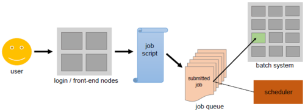

<style type="text/css">
body{ /* Normal  */
      font-size: 14pt;
  }
pre {
  font-size: 12pt
}
</style>

In this module, we will:

* discuss the Great Lakes HPC cluster and review its usage
* discuss software modules available on Great Lakes
* log in to the Great Lakes cluster using `ssh`
* review some of the fundamental helper commands on Great Lakes
* review SBATCH and submit jobs for our analysis

## Review - UMRCP and the Components We'll Use in This Workshop


<br>


## Great Lakes HPC

https://arc.umich.edu/greatlakes/

https://arc.umich.edu/greatlakes/slurm-user-guide/



### Scheduled Jobs


### Interactive vs Scripted Jobs

As we've discussed, for any computational tasks that are moderately demanding, we should not attempt them on the login nodes. Instead, we must request resources and arrange for our job to run on a worker node. In yesterday's exercises, we explored a couple of quick ways to request resources and run jobs using the 'Interactive App' web-based tools. Now, we'll discuss some additional, very useful and powerful ways that we can request resources and run jobs - through interactive jobs and scripted jobs.

FIXME: Elaborate right-sizing your SBATCH

### Interactive Jobs

```
srun --pty --job-name=${USER}_calculate_md5sum --account=bioinf_wkshp_class --partition standard --mem=2000 --cpus-per-task=1 --time=00:30:00 /bin/bash
```

### Exercise - Log in to Great Lakes using ssh

Following along with the instructor, we'll all log in to the Great Lakes cluster using ssh

### Exercise - Launch an Interactive Job and Calculate MD5sum

Following along with instructor, we'll launch an interactive job using `srun`. Once the job is allocated, we'll use the `md5sum` command to confirm the success and completeness of our data transfer.

### LMOD Modules

FIXME: Elaborate on LMOD

https://arc.umich.edu/software/


### SBATCH

```
#!/bin/bash
# The interpreter used to execute the script

#“#SBATCH” directives that convey submission options:

#SBATCH --job-name=Hello_SBATCH
#SBATCH --cpus-per-task=1
#SBATCH --nodes=1
#SBATCH --ntasks-per-node=1
#SBATCH --mem-per-cpu=400m
#SBATCH --time=00:05:00
#SBATCH --account=bioinf_wkshp_class
#SBATCH --partition=standard
#SBATCH --output=/nfs/turbo/umms-bioinf-wkshp/workshop/home/%u/sleeping_bear/logs/%x-%j.log

# The application(s) to execute along with its input arguments and options:

hostname
pwd

echo "Hello, SBATCH!"

sleep 60
```

## Exercise SBATCH Hello World

Following along with the instructor, we will inspect the `hello_SBATCH.sh` shell script that each of us have in our `$WORKSHOP_HOME` directory, review the preamble and body of it, and then submit it with `sbatch`. Once it is running, we will use `squeue` to view the status of the job. After it completes, we'll view its log.

## Exercise `srun` with LMOD

Following along with the instructor, we'll launch an interactive job with `srun`, load the samtools module, and use samtools to filter our sample_A BAM file to select only alignments from chromosome 19.

## Exercise SBATCH with LMOD

Following along with the instructor, we'll create an SBATCH script that is similar to our previous `srun` exercise, and use that to filter our sample_B BAM file in the same fashion. We will launch it with `sbatch` and inspect the results. If it is successful, we will continue this exercise by creating and running two more SBATCH scripts for sample_C and sample_D.


| [Previous lesson](odule03a_sneak_peek_great_lakes.html) | [Top of this lesson](#top) | [Next lesson](Module04_software_management_conda.html) |
| :--- | :----: | ---: |
