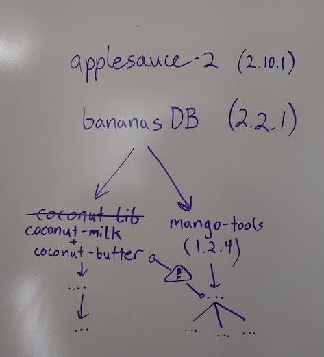
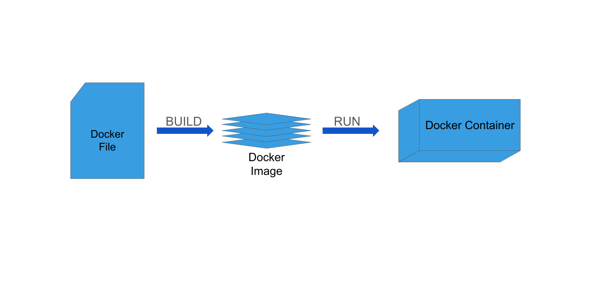

<style type="text/css">
body{ /* Normal  */
      font-size: 14pt;
  }
pre {
  font-size: 12pt
}
</style>

In this module, we will:

* learn about container systems Docker and Singularity
* discuss the what and why of containerization
* compare container solutions to other software management tools that we've discussed
* learn how to utilize publically available Docker or Singularity containers
* learn how to build our own singularity containers

## Commonalities Between Software Management Tools


## Overview of Containerized Software

The software management tools we've discussed so far are extremely helpful and important for reproducible research. However, they do have some limitations that we've mentioned, which we'll bring into focus and elaborate in this module as we consider some additional options - containerized software. We'll discuss in a moment what we mean by this term, but to start I'll mention some of the additional things that containerized software can grant us:

- Additional portability
- Additional isolation of compute environments
- Additional long-term reliability


The simplest way to think of containers is as if there is a virtual computer system, running inside of your computer. You can imagine that the hardware layout of your typical computer can also be recreated through software, and that is kind of what is happening when we use software containers. This is of course a gross simplification, but for now we can think of it in this way.

<br>
<br>


<br>

Imagine your typical hardware layout like shown above. Imagine that there is software that is able to respectfully request a portion of CPU and memory (RAM) from the system, and then create abstractions for all of the other portions that you see.

If you imagined that this would enable you to create several running "virtual computers" each taking a portion of the physical CPU and RAM available to them and treating it as their own, then you've basically imagined what containers can offer us.

You may have already heard the term "virtual machine" in the past, and this is a technology that is related to, but distinct from containers. We will be discussing containerization software specifically, and focusing on these because containers are more efficient, streamlined, and perfectly suited for reproducibility, when compared to virtual machines. When comparing between these, some things I'd like to highlight that work highly in favor of containerized software are:

- The usage of standardized specification files
  - e.g. Dockerfiles, Singularity definition files
  - allow for superior transparency and reproducibility.
- The layered nature of container architecture
  - During creation, the result of each task is formed into its own layer
  - The separate layers are "stacked" one over another until the entire environment is built
  - Allows for high transparency and portability, and streamlines the build process

<br>


<br>


### Sharing Software Environments

<br>


<br>


If we take the example of sharing an analysis with a colleague or a collaborator, we get to a point where we need to share not only the analysis code, but also the particulars of the compute environment that we ran the analysis within. Many of you may have an experience like this, where you tried to share some analysis code with a collaborator or with a colleague, and when they try to run it on their machine they are unsuccessful. Maybe they don't have the required software. Maybe they have some certain configuration details that are set incorrectly. Or maybe the software that you've given them is actually incompatible with some software that's running on their system. In the figure above, we've shown a very simplistic idea for getting around these issues, which is to just share your entire laptop with your colleague. However, you can imagine that there are many practical reasons why this is not a very good solution. 

So far we've started to hint at the idea of shareability as being integral to reproducibility. When we've discussed conda, there have been some limitations or aspects that are not quite ideal for sharing, that are remedied By using a solution like containers.

An important aspect of containers that makes them unique in this way is that after they're built according to specifications, the container is basically unchangeable. Once again, this is a simplification, but for the most common usages, in terms of shareability and reproducibility, we can consider it to be so.

There are several ways that you can share containerized software:

- Sharing the specification files (akin to sharing a conda recipe)
- Sharing by hosting the images in an accessible repository (Docker Hub)
- Sharing the image directly (Singularity Image File)

### Environment Isolation

Another important aspect of containers is their relative isolation from the host system when compared to something like Conda. Remember that when we are running software within a container, the software interacts with a completely virtualized version of the hardware system. By nature of that, that means that there is additional separation between the software in the container and the software that is outside of the container. Conda makes no such distinction, but rather uses a couple of tricks to make it easy to switch between environments. 

<br>


<br>

The isolation capabilities go hand in hand with the traits of encapsulation that are inherent to containerized software. If you design and build a

### Static Images are Stable Across Time



## Docker

We've discussed containerized software as a concept, and now it's time to dive into one containerization tool - in fact arguably the most widely used container software today.



Example of a Dockerfile:

```
FROM centos:centos7

RUN yum -y install wget gdb

COPY foo.yaml /tmp

RUN wget -P /tmp "https://download.example.com/example-installer-3.2.1.el7.x86_64.rpm" && \
    rpm -i /tmp/example-installer-3.2.1.el7.x86_64.rpm && \
    rm /tmp/example-installer-3.2.1.el7.x86_64.rpm

ENV PATH ${PATH}:/opt/foo/bin
```

## Singularity


Example of a Singularity definition file:

```
BootStrap: debootstrap
OSVersion: stable
MirrorURL: http://ftp.us.debian.org/debian/

%runscript
    echo "This is what happens when you run the container..."

%post
    echo "Hello from inside the container"
    apt-get update
    apt-get -y install fortune cowsay lolcat

%environment
    export PATH=$PATH:/usr/games
```


## Review


| [Previous lesson](Module04_software_management_conda.html) | [Top of this lesson](#top) | [Next lesson](Module FIXME .html) |
| :--- | :----: | ---: |
