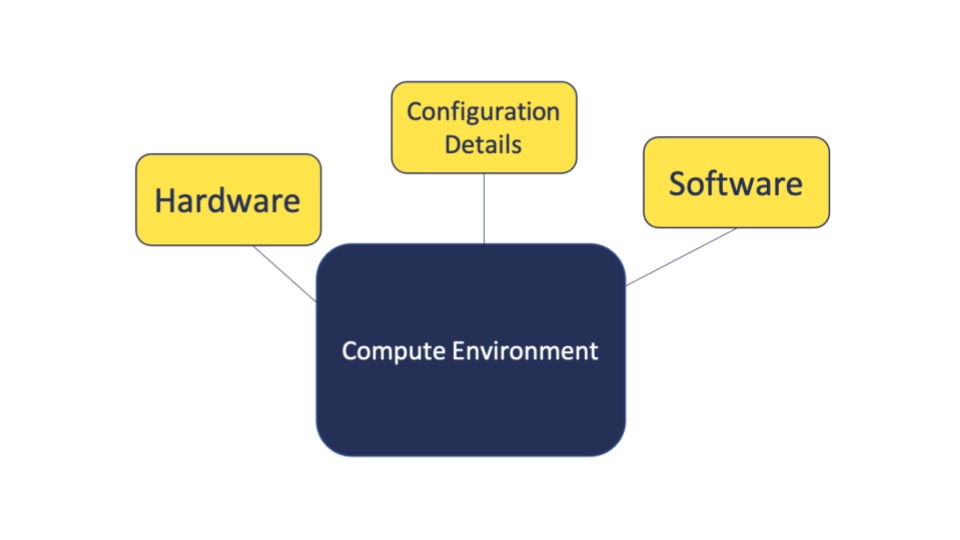

In this module, we will:

* discuss the idea of the "compute environment" and some related terms

 

## Components of the Compute Environment

 
 
 

 

### Related Terminology and Concepts

**Virtual Environment:**  
An isolated space within a compute environment where certain components - e.g. software and configuration details - can be used independently without interference from system-wide components or other projects  
Commonly used in software development and data analysis to avoid conflicts between different projects  
Kitchen metaphor: like a separate clean workspace within your kitchen for specific tasks - e.g. clean area for chopping vegetables  
**Environment Variable:**  
Information that is used by a computer's operating system that can influence the way that processes behave  
Commonly used to store information like file paths, usernames, system settings, etc.  
Kitchen metaphor: like a note on the refrigerator that states where different spices are located  

 

| [Previous lesson](Module_great_lakes_cluster.html) | [Top of this lesson](#top) | [Next lesson](Module_software_management_conda.html) |
| :--- | :----: | ---: |