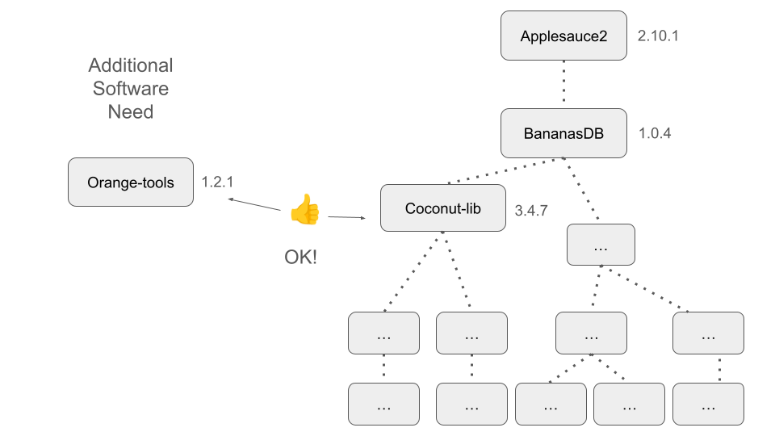
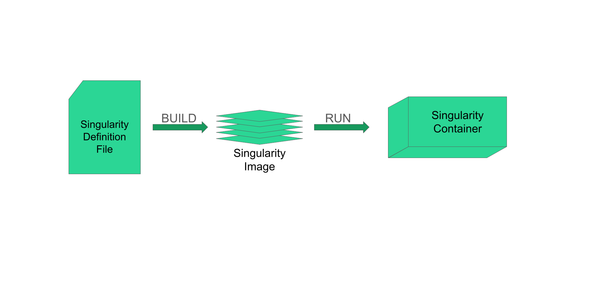

<style type="text/css">
body{ /* Normal  */
      font-size: 14pt;
  }
pre {
  font-size: 12pt
}
</style>

In this module, we will:

* learn about container systems Docker and Singularity
* discuss the what and why of containerization
* compare container solutions to other software management tools that we've discussed
* learn how to utilize publically available Docker or Singularity containers
* see how to build a new singularity container

## Commonalities Between Software Management Tools


## Overview of Containerized Software

The software management tools we've discussed so far are extremely helpful and important for reproducible research. However, they do have some limitations that we've mentioned, which we'll bring into focus and elaborate in this module as we consider some additional options - containerized software. We'll discuss in a moment what we mean by this term, but to start I'll mention some of the additional things that containerized software can grant us:

- Additional portability
- Additional isolation of compute environments
- Additional long-term reliability


The simplest way to think of containers is as if there is a virtual computer system, running inside of your computer. You can imagine that the hardware layout of your typical computer can also be recreated through software, and that is kind of what is happening when we use software containers. This is of course a gross simplification, but for now we can think of it in this way.

<br>
<br>


<br>

You may have already heard the term "virtual machine" in the past, and this is a technology that is related to, but distinct from containers. We will be discussing containerization software specifically, and focusing on these because containers are more efficient, streamlined, and perfectly suited for reproducibility, when compared to virtual machines. When comparing between these, some things I'd like to highlight that work highly in favor of containerized software are:

- The usage of standardized specification files
  - e.g. Dockerfiles, Singularity definition files
  - allow for superior transparency and reproducibility.
- The layered nature of container architecture
  - During creation, the result of each task is formed into its own layer
  - The separate layers are "stacked" one over another until the entire environment is built
  - Allows for high transparency and portability, and streamlines the build process

<br>


To cover some terminology and to give a broad overview of the flow of using containers, we'll briefly discuss this figure.

<br>


### Sharing Software Environments

<br>


Let's revisit the topic of sharing analyses once again. We've discussed how some of you may have experienced friction when trying to share some analysis code with a collaborator or with a colleague - when they try to run the analysis on their machine they are unsuccessful. Maybe they don't have the required software. Maybe they have some certain configuration details that are set incorrectly. Or maybe the software that you've given them is actually incompatible with some software that's running on their system. In the figure above, we've shown a very simplistic idea for getting around these issues, which is to just share your entire laptop with your colleague. However, you can imagine that there are many practical reasons why this is not a very good solution. 

We've discussed some solutions that can aid in these sharing tasks, without having to resort to actually sharing your entire computer with your colleague. In many ways, these solutions allow us to get past this friction. Let's take a moment to think about our experiences with LMOD modules and conda, and describe their strengths and limitations.

<!-- LIVE_NOTE: Highlight the limitation of conda - while we can share recipes, we can't really share the built environment. Relate to stale links on the internet - it's not guaranteed to stay intact forever! -->

<br>

Now we shift our focus back to containers, and how they can offer some solutions to the limitations of other options. An important aspect of containers that makes them powerful is that after they're built according to specifications, the container is basically unchangeable. Once again, this is a simplification, but for the most common usages, in terms of shareability and reproducibility, we can consider it to be so.

In addition to being stable once created, it is also shareable after creation. This benefit cannot be overstated. By being able to share the static environment after it has been created, and to know that it will remain stable and usable far into the future, we can ensure reproducibility far into the future as well.

There are several ways that you can share containerized software:

- Sharing the specification files (akin to sharing a conda recipe)
- Sharing by hosting the images in an accessible repository (Docker Hub, Quay IO, Biocontainers)
- Sharing the image directly (Singularity Image File)

<br>

### Environment Isolation


Another important aspect of containers is their relative isolation from the host system when compared to something like Conda. Remember that when we are running software within a container, the software interacts with a completely virtualized version of the hardware system. By nature of that, that means that there is additional separation between the software in the container and the software that is outside of the container. Conda makes no such distinction, but rather uses a couple of tricks to make it easy to switch between environments. 


<br>

### Static Images are Stable Across Time


<br>
<br>
<br>



We'll briefly revisit this idea and relate it to the incompatibility scenario that we described in the previous module.

<br>

### Not Just Software

Containers can be bundled with more than software - things like environment variables, configuration files, etc. can be included. For some tools, this is a critical aspect of providing simple plug-and-play usability.

<br>

## Docker

We've discussed containerized software as a concept, and now it's time to briefly discuss a specific containerization tool - in fact arguably the most widely used container software today - Docker.


<!-- LIVE_NOTE: Emphasize that images are shareable on DockerHub, and then executable. Also want to highlight that we can't directly use Docker on Great Lakes, but we can still use docker images with the next software we'll discuss, singularity -->

<!-- LIVE_NOTE: Emphasize that Docker assumes that you have full control over a system. On an HPC, this is not the case, there are systems in place that keep us from stepping on each-others toes. -->

<br>

<details>
<summary>Example of a Dockerfile</summary>

```
FROM centos:centos7

RUN yum -y install wget gdb

COPY foo.yaml /tmp

RUN wget -P /tmp "https://download.example.com/example-installer-3.2.1.el7.x86_64.rpm" && \
    rpm -i /tmp/example-installer-3.2.1.el7.x86_64.rpm && \
    rm /tmp/example-installer-3.2.1.el7.x86_64.rpm

ENV PATH ${PATH}:/opt/foo/bin
```

</details>

<br>

## Singularity



Example of a Singularity definition file:

```
BootStrap: debootstrap
OSVersion: stable
MirrorURL: http://ftp.us.debian.org/debian/

%runscript
    echo "This is what happens when you run the container..."

%post
    echo "Hello from inside the container"
    apt-get update
    apt-get -y install fortune cowsay lolcat

%environment
    export PATH=$PATH:/usr/games
```

### Some Quick Notes on Singularity

- It is a purpose-built containerization software for an HPC system
- Singularity can also run Docker containers
- We have several repositories at our fingertips
  - Docker Hub - https://hub.docker.com
  - Biocontainers - https://biocontainers.pro
  - Quay IO - https://quay.io
  - Galaxy Project - https://depot.galaxyproject.org/singularity/


<!-- LIVE_NOTE: Do a demonstration of going to Quay.io and getting samtools and deeptools images -->

## Exercise - `srun`, `singularity shell`, Filter and Index a BAM

<!-- LIVE_NOTE: Also do sanity check -->

Following along with the instructor, we'll launch an interactive job with `srun`. Once we've entered the running job, we will use singularity with an existing samtools docker image and launch a 'singularity shell'. With the samtools software now available, we'll filter and index sample_A.

After we complete this, we'll delete the filtered & indexed BAM file, to start fresh for our SBATCH exercises.

<details>
<summary>`srun`, `singularity shell`, Filter and Index BAM - Solution</summary>

`srun --pty --job-name=${USER}_singularity_filter_and_index --account=bioinf_wkshp_class --partition standard --mem=2000 --cpus-per-task=2 --time=00:20:00 /bin/bash`

`mkdir filter_viz_singularity`

`module load singularity`

`singularity shell docker://quay.io/biocontainers/samtools:1.20--h50ea8bc_0`

`samtools view -o filter_viz_singularity/sample_A.chr19.bam input_bams/sample_A.genome.bam 19`

We'll also do a sanity check here:

`samtools view filter_viz_singularity/sample_A.chr19.bam | wc -l`

As well as index the BAM (bamCoverage will need the index in the next step)

`samtools index filter_viz_singularity/sample_A.chr19.bam`

</details>

<br>

<!-- LIVE_NOTE: Skip several exercises -->

## Exercise - SBATCH, `singularity exec`, Filter and Index a BAM

Following along with the instructor, we'll use the nano editor to create an SBATCH file and use `singularity exec` to filter and index our sample_A BAM file. We'll submit the job with `sbatch` and review its log file and output.

<br>

## Exercise - SBATCH, `singularity exec`, Filter and Index all BAMs

Following along with the instructor, we'll quickly create additional sbatch files that can use `singularity exec` to filter and index the rest our samples. We'll submit those jobs with `sbatch` and review once again.

<br>

## Exercise - `srun`, `singularity shell`, Sanity Check All Samples

Following along with the instructor, we'll launch an interactive job with `srun`. Once we've entered the running job, we'll use `singularity shell` and quickly perform a sanity check on all of our filtered BAM files, counting the entries in each file.

<!-- LIVE_NOTE: write our sanity check command to a file to record it for future -->

<br>

## Exercise - `srun`, `singularity exec`, Create a Bigwig

<!-- LIVE_NOTE: We'll demonstrate singularity exec in this exercise -->

Following along with the instructor, we'll launch an interactive job with `srun`. Once we've entered the running job, we'll use singularity with an existing deeptools docker image and launch a 'singularity shell'. With the `bamCoverage` command now available, we'll create a Bigwig for sample_A.

After we complete this, we'll delete the newly created Bigwig file, so that we can start fresh on our SBATCH exercises.

<details>
<summary>`srun`, `singularity exec`, Create a Bigwig - Solution</summary>

`srun --pty --job-name=${USER}_singularity_create_bigwig --account=bioinf_wkshp_class --partition standard --mem=2000 --cpus-per-task=2 --time=00:30:00 /bin/bash`

`module list`

`module load singularity`

`singularity exec docker://quay.io/biocontainers/deeptools:3.5.5--pyhdfd78af_0 bamCoverage -b filter_viz_singularity/sample_A.chr19.bam -o filter_viz_singularity/sample_A.chr19.bigwig`

</details>

<br>

<!-- LIVE_NOTE: Skip create all bigwigs exercise -->

## Exercise - SBATCH, Singularity, Create Bigwigs for All BAMs

In the same pattern as we've established for our filtering task, we'll with a single sample, sample_A and craft an SBATCH file to create a Bigwig file for that one sample before moving on to others.

<br>

<!-- LIVE_NOTE: Remember to have users move their conda env -->

<!-- LIVE_NOTE: Take time to document and to tidy up -->


## Demonstration - Remote Build of a Singularity Image

So far we've only demonstrated uses where we use existing docker or singularity images. While we've shown that this is powerful and easy to use, we aren't taking full advantage of singularity's capabilities without building new images.

This topic is outside the scope of this workshop, but we want to demonstrate that it is possible to build singularity containers. It's not quite straightforward to do so on Great Lakes, but with a little bit of extra setup it is possible to use a remote builder, which we'll demonstrate.

For more information about the remote build process, see the documentation here:

[Link to documentation on remote builds](https://docs.sylabs.io/guides/latest/user-guide/build_a_container.html#remote-builds)

<details>
<summary>Demo Remote Build - Solution</summary>

We'll create a singularity definition file called `cowsay.def`

`nano cowsay.def`

Contents of `cowsay.def` are shown in the singularity definition file shown in the above lesson.

Note, to use the remote builder with the `--remote` flag, you must follow the instructions on remote builds above - create an account and generate a token online, then use `singularity remote login`.

`singularity build --remote cowsay.sif cowsay.def`

After this, we have a singularity image file, `cowsay.sif` that we can use with `singularity shell cowsay.sif` or `singularity exec cowsay.sif cowsay Mooo`

</details>

<br>
<br>
<br>
<br>

## Review of LMOD, Conda, Docker, and Singularity


In choosing any tool, we must consider the inherent trade-offs between simplicity, portability, and durability.

<br>

---


| [Previous lesson](Module_software_management_conda.html) | [Top of this lesson](#top) | [Next lesson](Module_intro_to_workflow_automation.html) |
| :--- | :----: | ---: |
