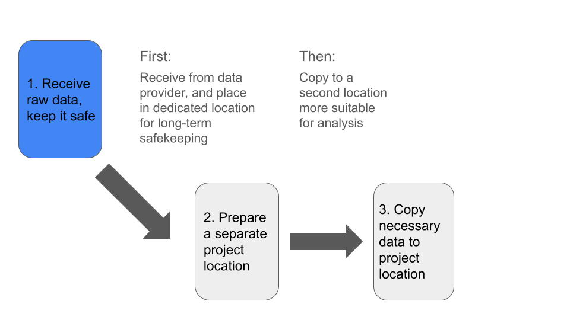
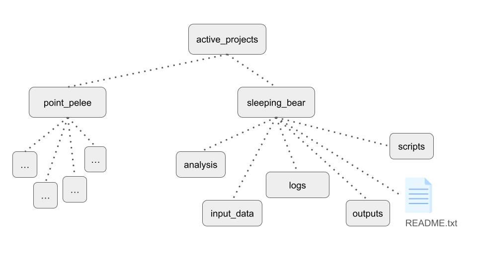

In this module, we will:

* suggest priorities and overall treatment of experimental data and active analysis projects
* discuss organization practices and recommendations for anlaysis files, intermediate outputs, scripts, etc.
* utilize some of the access methods mentioned in the previous module
* use the Great Lakes web-based text editor and gain practice documenting 

 

### Overall Approach

One simple way to organize our thinking about storage best practices is to divide the topic into raw data considerations, and considerations for analysis projects. By separating and focusing on those two aspects, we can effectively address many of the challenges associated with each.

>Note: The importance of documentation is universal to all aspects of reproducible research. In considering best practices both for our raw data and for our analysis projects, we will emphasize the importance of documentation!

 

### Data Priorities

 

In general, our first priority is to receive our raw data and keep it in a safe location.  
Next, we want to prepare a secondary location where we will conduct our analysis.  
Finally, we'll copy the subset of data needed for analysis, into our prepared analysis project location.  

 

We also have several things to consider, before acting on each of these priorities:

| Step | Step Name       | Preparatory Action                              |
|:---- |:--------------- |:------------------------------                  |
| 1    | Receive Data    | Determine Sufficient Storage:                   |
|      |                 | - Total size                                    |
|      |                 | - Total # files                                 |
| 2    | Prepare Project | Determine if analysis location is appropriate:  |
|      |                 | - Total size (including intermediates)          |
|      |                 | - Fast connection to compute hardware           |
|      |                 | - Separate from raw data                        |
| 3    | Copy Data       | Document critical details:                      |
|      |                 | - Permanent location of the raw data            |
|      |                 | - Type of data, info from data provider, etc.   |

 

### Raw Data - Overview

When considering best practices for raw data storage, we can generally orient ourselves around one task - ensure that the data are safe.

Safe from:

- Accidental deletion
- Hardware failure
- Loss of access

With this in mind, we recommend placing your raw experimental data into a specific designated location which is **solely** dedicated to storing your raw data.

In the next module we'll discuss specific options for UMich researchers, but for now we'll just speak of the general process. Data that cannot easily be re-obtained should be treated with great care. By following the recommendations here, we can achieve this and have peace of mind that we are preserving our raw data and our capabilities for reproducible research well into the future.

 

### Analysis Projects - In-Depth Look

We can begin thinking of our next task - handling data and organizing files and artifacts for our analysis - by starting with the idea of the data flow described above. One of the first tasks in this area is to set up a new location for your analysis and make a copy of your raw data there.

Some considerations:

 - Fast storage, well suited for computation
 - Project organization that facilitates reproducibility
 - In-progress analyses, cleanup procedures, and end-to-end repeatable analyses

When we think about fast storage that is well suited for computation, we mostly contrast that with our long-term archival storage. A storage option is well suited for computation if it is accessible via high-throughput connection to sufficiently powerful processing hardware. The speed of reading and writing from this location can greatly affect processing times of your analysis, depending on the steps involved.

In terms of project organization, generally we want to have distinct locations for specific purposes, and preferably organizing things in a consistent manner for all of our projects.

In a particular project, you may want:

- `input_data` directory for copy of raw data
- `scripts` directory for analysis scripts
- Directories for intermediates, log files, and final outputs
- `README.txt` for the project
- `docs` directory for extensive documentation, supporting works, etc.

A useful idea for our project directory layouts is to think about the project life cycle and work towards an end-goal of a reproducible analysis. While at the beginning of an analysis many things may be flexible, at the end we will want to be able to re-execute the analysis starting from the raw input data and running all the way until it produces the final outputs.

Taking time to segregate specific efforts within a project, documenting our steps as we perform in-progress analyses, performing cleanups where needed, and similar efforts will aid us as we work towards that goal.

Think ahead when designing the layout of your projects. If you will be trying several related analysis approaches using the same input data, but intend on using results from only one of the evaluated methods, it may make sense to intentionally subdivide the contents of your project directory accordingly. If you have several distinct analyses that use different input datasets, then creating separate project directories for each of them will likely make the most sense. It's hard to be totally prescriptive when making recommendations here, but through our example we hope to spark the kinds of conversations and the types of thinking that are required here.

One last note on handling and organizing analysis projects - use some form of identification system for projects in your lab or research group. This simplifies communication and record keeping, in addition to the organizational benefits.

Some ideas for project identification systems:

- Codenames
- Alphanumeric IDs
- Short contextual descriptions

 

<!-- LIVE_NOTE: Ask if anyone has any preferences, or what might work best for their group and why -->

## Exercise - Organize Intro Project and Save Results

Following along with the instructor, we'll organize some of the files that are in our `$WORKSHOP_HOME` directory.  
When we're ready, we can re-try running the hello_alcott scripts - this time redirecting our outputs into files.

 

## Exercise - Write a README File

Following along with the instructor, we will write the beginnings of a README for our intro project as it exists so far.

 

### Handy Links

- [Link to Great Lakes Dashboard](https://greatlakes.arc-ts.umich.edu)

 

## Review

- It can be helpful to think about our raw data and our analysis data separately.
- Typically, the first priority is ensuring that raw data is stored in a separate, long-term storage location
- Organizing our projects in a consistent manner provides many benefits - pre-arranging project folders can help!
- Documentation is critical - record information about receipt of raw data and about your ongoing projects

 
 

| [Previous lesson](Module_overview_and_warmup.html) | [Top of this lesson](#top) | [Next lesson](Module_storage_best_practices_UMRCP.html) |
| :--- | :----: | ---: |
