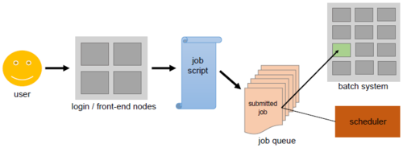
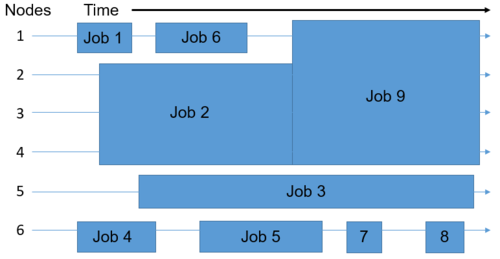

<style type="text/css">
body{ /* Normal  */
      font-size: 14pt;
  }
pre {
  font-size: 12pt
}
</style>

In this module, we will:

* discuss the Great Lakes HPC cluster and review its usage
* discuss software modules available on Great Lakes
* log in to the Great Lakes cluster using the web-based shell
* review some of the fundamental helper commands on Great Lakes
* review SBATCH and submit jobs for our analysis

<br>

## Great Lakes HPC

Again, we'll provide the link to ARC's general overview page on Great Lakes here: https://its.umich.edu/advanced-research-computing/high-performance-computing/great-lakes


<br>

### A More Detailed Look at How Great Lakes Works


We may have briefly mentioned the concept of a login node and a worker node when getting acquainted with Great Lakes, but we kept the explanation minimal, and only stated the fact that resources must be specified ahead of time for our tasks. With this figure we can dive a bit deeper into how this works.

<br>

### Software Modules Available on Great Lakes

For our benefit, ARC has made available a plethora of widely used and oft-requested software tools, via their module system. We may refer to this module system as LMOD. We won't cover the details of how it works<!-- LIVE_NOTE: note we will revisit this idea when comparing with other software management solutions later -->, however we'll demonstrate their usage and get a feel for using these LMOD modules on Great Lakes in our exercises.

The usage is very simple:

- `module list` to list currently loaded modules
- `module load <name-of-module>` to enable a particular module
- `module unload <name-of-module>` to disable that module
- `module purge` to unload all modules
- `module keyword <keyword>` to search the modules for a particular keyword
- `module spider <name-of-module>` to view all versions of a particular software - many different versions may be available
- `module avail` to list all LMOD modules available

We'll use these command-line methods for exploring and using LMOD modules in our exercises shortly, but it may also be helpful to later review this [link to all software modules available on various ARC HPC clusters](https://websites.umich.edu/~greatlakes/catalog/).

<br>

### Scheduled Jobs



We've taken a look into how, but now we're going to go a little deeper on the why aspect - why is the HPC cluster set up this way? 

Remember, this infrastructure must support the entire university. This means that we need a system to provide resources in a controlled, efficient, and reasonably fair way.

By having formal mechanisms for requesting resources, and utilizing a job queue and a scheduler to allocate resources and assign them to jobs, we can achieve these goals.

<!-- LIVE_NOTE: Relate the efficiency of the scheduled jobs in the figure. Idle time is minimized, while many differently-sized jobs can run simultaneously -->

<br>

### Interactive and Scripted Jobs

We've gained a little experience with some types of interactive jobs, for instance during our `RStudio` demonstration. During that preview, we mentioned that there are other ways of doing requesting resources for interactive jobs, and we'll discuss those here.

We've just logged in using SSH to the Great Lakes HPC, and now we're all interacting with the login node. Thinking back to yesterday when we were writing the README file, we were similarly interacting with the login node.  We mentioned that we can't do anything compute-intensive here, and instead offered the OpenOnDemand apps as an alternative.

What we didn't discuss was that where we are now - on the login node - we have the ability to request resources and run jobs via the command line. These are the powerful abilities that we alluded to, and we have two ways of doing this - interactive and scripted jobs.

<!-- LIVE_NOTE: These are both examples of scheduled jobs, either way we'll request resources and use them once granted -->

<br>

### Interactive Jobs

When we speak of interactive jobs on the command line, what we really mean is that we request resources in a special way so that once they are granted, our shell will be 'sent' into a worker node, and we will be able to interact with a command-line interface that is running inside of our worker node. We'll have all of our desired resources, and we'll be able to execute our compute-intensive tasks in an interactive way.

In some of the educational material provided by ARC, a lot of times they will introduce this idea later on, or briefly mentioned as an aside. However, we want to introduce it right away, because it's very useful as a starting point, and is a great way to 'right-size' your scripted jobs, which we'll cover in a moment.

When would we want to run an interactive job?

- When we're not quite sure about the resources needed
- When we want to verify that our commands will work correctly
- When runtimes are relatively short and commands are fairly straightforward

<!-- LIVE_NOTE: Commands inside of the interactive job may lack reproducibility, we have to manually record what we do within the interactive job. -->

How do we launch an interactive job from the command line? See the example here:

```
srun --pty --job-name=${USER}_hello_alcott --account=bioinf_wkshp_class --partition standard --mem=2000 --cpus-per-task=1 --time=00:30:00 /bin/bash
```

<br>

### Scripted Jobs

When we talk about scripted jobs, generally we mean that inside of a file we place commands that we want to run in order - a script - along with the resource requirements.

In this case, when the resources become available, the contents of the script are executed on a worker node. There is no interaction with the running job<!--**LIVE_NOTE: Except maybe to observe it** -->. Any feedback that we'd normally receive in the terminal, can go to a log file. We'll see an example of this.

When would we want to run scripted jobs?

- When we're confident that our script/processes are correct and do what we want
- When we're confident that we are requesting adequate resources
- When we want reproducibility
- When we want scalability, we have the ability of creating many scripted jobs ahead of time, and launching them all at once

<!-- LIVE_NOTE: There are many solutions for scalability, that can leverege scripted jobs without as much upfront work. Chris will cover these tomorrow -->

What does a scripted job look like? See the dropdown section here:

<!-- LIVE_NOTE: We'll see this in just a moment, no need to look at it here -->

<details>
<summary>SBATCH example</summary>

```
#!/bin/bash
# The interpreter used to execute the script

#“#SBATCH” directives that convey submission options:

#SBATCH --job-name=Hello_SBATCH
#SBATCH --cpus-per-task=1
#SBATCH --nodes=1
#SBATCH --ntasks-per-node=1
#SBATCH --mem-per-cpu=400m
#SBATCH --time=00:05:00
#SBATCH --account=bioinf_wkshp_class
#SBATCH --partition=standard
#SBATCH --output=/nfs/turbo/umms-bioinf-wkshp/workshop/home/%u/intro_scripts/%x-%j.log

# The application(s) to execute along with its input arguments and options:

hostname
pwd

echo "Hello, SBATCH!"

sleep 60
```

</details>

<br>

Briefly, we place our resource requirements at the top of our file - the preamble - and then we place our scripted commands until the end of the file. Once we have our file written - our SBATCH file - we'll launch it with the command `sbatch`. For example:

`sbatch <name-of-SBATCH-file>`

We'll have a chance to try this in a moment, after we get warmed up with some interactive jobs.

>Note: We're just going to demonstrate some of the most salient bits of requesting resources. There are a lot more informational resources available at [ARC's SLURM user guide](https://documentation.its.umich.edu/arc-hpc/slurm-user-guide).

<br>

## Exercise SBATCH Hello World

Following along with the instructor, we will inspect the `hello_sbatch.sh` shell script that each of us have in our `$WORKSHOP_HOME` directory, review the preamble and body of it, and then submit it with `sbatch`. Once it is running, we will use `squeue` to view the status of the job. After it completes, we'll view its log.

<details>
<summary>SBATCH Hello World - Solution</summary>

```sh
source /nfs/turbo/umms-bioinf-wkshp/workshop/home/${USER}/source_me_for_shortcut.sh

cd ${WORKSHOP_HOME}/intro_scripts

sbatch ./hello_sbatch.sh

# While the job is running, check the job queue with:
squeue -u $USER
```

</details>

<br>

## Exercise `srun` with LMOD - Revisiting hello_alcott Examples

Following along with the instructor, we'll launch an interactive job with `srun`, load the python LMOD module, and then revisit our hello_alcott examples.

<details>
<summary>`srun` with LMOD hello_alcott - Solution</summary>

```sh
srun --pty --job-name=${USER}_hello_alcott --account=bioinf_wkshp_class --partition standard --mem=500 --cpus-per-task=1 --time=00:10:00 /bin/bash

cd ${WORKSHOP_HOME}/intro_scripts

which python

module spider python

module load python/3.11.5
which python

python hello_alcott.py -i ${WORKSHOP_HOME}/intro_data/alcott_little_women_full.txt
```

<!-- LIVE_NOTE: Just for fun we might also run ./hello_alcott.sh ${WORKSHOP_HOME}/intro_data/alcott_little_women_full.txt -->

>Note: Type the command `exit` to exit from a running interactive job. This will put you back onto the log in node and free up remaining resources.

</details>

<br>

## Exercise SBATCH with LMOD - hello_alcott Cont'd

Following along with the instructor, we'll create an SBATCH script that is similar to our previous `srun` exercise, but this time we will launch it with `sbatch` and see how that works.

<details>
<summary>SBATCH with LMOD hello_alcott Cont'd - Solution</summary>

```sh
cd ${WORKSHOP_HOME}
mkdir -p projects/hello_alcott
cp intro_scripts/hello_sbatch.sh projects/hello_alcott/hello_alcott_sbatch.sh
cd projects/hello_alcott
```

Edit the file appropriately - We'll use the web-based text editor for ease-of-use, but a command-line based text editor like `nano` could also work well here.

[Link to Great Lakes Dashboard](https://greatlakes.arc-ts.umich.edu)

<!-- LIVE_NOTE: You'll need this path handy to paste into the changedir modal: /nfs/turbo/umms-bioinf-wkshp/workshop/home/ -->

When we're happy with our SBATCH script, we can submit it.

```sh
sbatch hello_alcott_sbatch.sh
```

We'll look for the log file in our project folder, and inspect it for the outputs.

</details>

<br>

<!-- LIVE_NOTE: Reveal that we have some more interesting tasks left for analyzing the Alcott text - dialog attribution -->

<!-- LIVE_NOTE: Do a show-only demonstration of lack of wordcloud package - we need to install it - we may be tempted to pip install it, but stay tuned for the next modules amd we'll offer better alternatives -->

>Note: If you have the python module loaded, make sure to `unload` it, so that it does not interfere with the exercises in the next sections!

```sh
module unload python
```

---


| [Previous lesson](Module_storage_best_practices_UMRCP.html) | [Top of this lesson](#top) | [Next lesson](Module_compute_environment_definition.html) |
| :--- | :----: | ---: |
