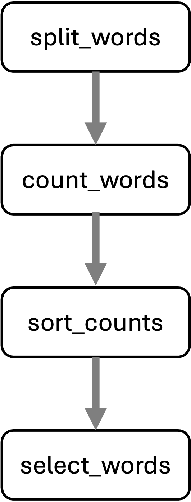

<style type="text/css">
body{ /* Normal  */
      font-size: 14pt;
  }
pre {
  font-size: 12pt
}

.wrapper { overflow-x: auto; }
.wrapper table { white-space: nowrap; }

</style>

By the end of this module, we will:

* List the some advantages of a robust workflow automation solution like Snakemake.
* Describe the fundamental relationship between Snakemake, a Snakefile, and the file system.
* Describe key parts of a Snakemake rule.
* Build a Snakefile and use Snakemake to automate a simple workflow.
* Show a Snakemake dry-run


## What is Snakemake?

Snakemake is a python program that interprets a text file describing your
workflow against the file system and uses rules in that workflow to transform
inputs into outputs as necessary. Snakemake is essentially **declarative**
meaning that you don't tell it what to do, you simply ask for the final output
and Snakemake figures out what it needs to do. That declarative pattern supports
several key attributes:

- Snakemake workflows can gracefully extend to new inputs.
- Snakemake is modular.
- Snakemake is portable.
- Snakemake is “durable” (i.e it crashes with poise).
- Snakemake is efficient.


## Build a Snakefile

A Snakefile is a text file that decribes your workflow. It is interpreted by the
`snakemake` command. Building a good Snakefile is the key step in understanding
Snakemake, so we'll begin there.

### Consider a sample bash script

To build a Snakefile it's helpful to use a concrete example and also helpful to
adapt an existing script. The script below considers the 1868 novel "Little
Women", by Louisa May Alcott. It outputs a file containing the ranked name
counts for each of the four March sisters: Amy, Beth, Jo, and Meg. (It
also emits a few intermediate files).


<table class='fig'><tr><th class='fig' colspan="2">alcott_script/alcott_script.sh</th></tr>
<tr>
<td class='fig'></td>
<td class='fig'><pre>
#!/bin/bash
# Which of the March sisters is referred to most often in
# part 1 of the Little Women?

# Split lines into words
cat inputs/little_women_part_1.txt \
    | tr -cs '[:alpha:]' '\n' \
    > 1.split_words.txt

# Count words
sort 1.split_words.txt | uniq -c \
    > 2.count_words.txt

# Sort words by descending count and add header
sort -k1,1nr 2.count_words.txt \
    | awk 'BEGIN {print "word\tcount"} { print $2 "\t" $1}' \
    > 3.sort_counts.txt

# Select names with respective counts
egrep '^(Jo|Amy|Meg|Beth)\s' 3.sort_counts.txt > 4.select_words.txt
</pre></td>
</tr></table>
<br/>


It's not necessary to understand the command in detail, but it is helpful to 
consider the steps with their various outputs:


<table class='fig'><tr><th class='fig'>Inputs, steps, and outputs</th></tr>
<tr><td class='fig'>inputs/little_women_part_1.txt</td></tr>
<tr><td class='fig'><pre>
CHAPTER ONE

PLAYING PILGRIMS

"Christmas won't be Christmas without any presents," grumbled Jo, lying
on the rug.

"It's so dreadful to be poor!" sighed Meg, looking down at her old
dress.
...
</pre></td></tr>
<tr><td class='fig'>1.split_words.txt</td></tr>
<tr><td class='fig'><pre>CHAPTER
ONE
PLAYING
PILGRIMS
Christmas
won
t
be
Christmas
without
</pre></td></tr>
<tr><td class='fig'>2.count_words.txt</td></tr>
<tr><td class='fig'><pre>
   1992 a
     75 A
      1 aback
      1 abase
      3 abashed
      1 abed
      1 abject
      3 able
      3 abominable
      1 abominably
</pre></td></tr>
<tr><td class='fig'>3.sort_counts.txt</td></tr>
<tr><td class='fig'><pre>
word	count
and	3811
the	3303
to	2303
a	1992
I	1988
her	1660
of	1490
in	1094
you	1010
</pre></td></tr>
<tr><td class='fig'>4.select_words.txt</td></tr>
<tr><td class='fig'><pre>
Jo      737
Meg     508
Beth    294
Amy     283
</pre></td></tr>
</table>
<br/>


To view the results interactively, you can execute the script.

```sh
export WORKSHOP_HOME="/nfs/turbo/umms-bioinf-wkshp/workshop/home/${USER}"
cd $WORKSHOP_HOME/workflows/project_alcott/alcott_script

./alcott_script.sh
```

And view excepts of the results in `less`. (Hit `q` key to exit `less`.)

```sh
head inputs/little_women_part_1.txt *.txt | less
```

### Snakemake and the Snakefile

Switch to the alcott_snakemake dir; note there are inputs and a Snakefile
```sh
cd $WORKSHOP_HOME/workflows/project_alcott/alcott_snakemake
tree
```
> ```
.
├── inputs
│   ├── little_women_part_1.txt
│   └── little_women_part_2.txt
└── workflow
    └── Snakefile
  ```


A Snakefile is a simple markdown file.By convention, the
snakefile is named `Snakefile` and lives in the `workflow` sub-directory. 
The current Snakefile is simply a stub based on the earlier bash script:

<table class='fig'><tr><th class='fig'>workflow/Snakefile</th></tr>
<tr><td class='fig'><pre>
# split_words ###########################################################
#cat inputs/little_women_part_1.txt \
#    | tr -cs '[:alpha:]' '\n' \
#    > 1.split_words.txt
# count_words ###########################################################
#sort 1.split_words.txt | uniq -c \
#    > 2.count_words.txt
## sort_count ###########################################################
#sort -k1,1nr 2.count_words.txt \
#    | awk 'BEGIN {print "word\tcount"} { print $2 "\t" $1}' \
#    > 3.sort_counts.txt
# select_words ##########################################################
#egrep '^(Jo|Amy|Meg|Beth)\s' 3.sort_counts.txt > 4.select_words.txt
</pre></td></tr></table>


A snakefile is composed of rules; each rule has a name and specifies directives such as

- input (what the rule requires)
- output (what the rule promises to generate)
- shell (how it will make input into output)

We add the first step in the workflow as a new rule. (Adding below the existing
comment block.) Note that we will keep the input files and result files in 
separate directories.

```
rule split_words:
    input: "inputs/little_women_part_1.txt"
    output: "results/little_women_part_1.split_words.txt" 
    shell: "cat inputs/little_women_part_1.txt | tr -cs '[:alpha:]' '\n' > results/little_women_part_1.split_words.txt"
```

### Running Snakemake

- The **snakemake** python program interprets the Snakefile and executes rules as 
appropriate to produce the expected output. 
- The snakemake program is installed as a module on Great Lakes.
- When launching snakemake, You specify the number of cores (i.e. CPUs) with the
-c flag. We will use 1 core.

```sh
module load snakemake
module list
# confirm you are in the right working directory
tree
```

> ```sh=
Currently Loaded Modules:
  1) python3.10-anaconda/2023.03   2) snakemake/7.32.4
$ tree
.
├── inputs
│   ├── little_women_part_1.txt
│   └── little_women_part_2.txt
└── workflow
    └── Snakefile
  ```


Run `snakemake` command as below. Note:

- `snakemake` will look for a Snakefile in the workflow directory.
- `snakemake` emits a log to the screen that include 
  - run details
  - Job stats
  - Rule details
  - Completion status i.e. (100%) done

```
snakemake -c1
```


> ```
    Building DAG of jobs...
    Using shell: /usr/bin/bash
    Provided cores: 1 (use --cores to define parallelism)
    Rules claiming more threads will be scaled down.
    Job stats:
    job            count
    -----------  -------
    split_words        1
    total              1
    .
    Select jobs to execute...
    .
    [Mon Jun 10 18:35:41 2024]
    rule split_words:
        input: inputs/little_women_part_1.txt
        output: results/little_women_part_1.split_words.txt
        jobid: 0
        reason: Missing output files: results/little_women_part_1.split_words.txt
        resources: tmpdir=/tmp
    .
    [Mon Jun 10 18:35:41 2024]
    Finished job 0.
    1 of 1 steps (100%) done
    Complete log: .snakemake/log/2024-06-10T183541.204636.snakemake.log
  ```

Check the file system. Note new results/ dir and new file. Note that `snakemake`
created the results/ dir automatically.

```sh
tree
```

> ```
.
├── inputs
│   ├── little_women_part_1.txt
│   └── little_women_part_2.txt
├── results
│   └── little_women_part_1.split_words.txt
└── workflow
    └── Snakefile
  ```

Also note that `snakemake` creates a hidden directory `.snakemake/` in the working 
directory. This holds various info that help snakemake manage the workflow. It's
extremely rare for you to need to examine the contents of the `.snakemake/` 
directory, but FYI.

If you re-run `snakemake` it determines the filesystem is up to date and no 
rules need to be triggered.

```sh
snakemake -c1
```

> ```
Building DAG of jobs...
Nothing to be done (all requested files are present and up to date).
Complete log: .snakemake/log/2024-06-10T184850.944535.snakemake.log
  ```


### Add a new rule

In the Snakemake file, add the second step as a new rule below the first rule.
Note that the inputs of this rule match the outputs of the prior rule.

```
rule count_words:
    input: "results/little_women_part_1.split_words.txt"
    output: "results/little_women_part_1.count_words.txt"
    shell: "sort results/little_women_part_1.split_words.txt | uniq -c > results/little_women_part_1.count_words.txt"
```

By default, `snakemake` only runs the first rule in the Snakefile. To trigger 
the new rule, you can specify the desired end target on the command line.

```sh
snakemake -c1 count_words
```

Note the log output similar to above, but now shows the new rule.

> ```
Building DAG of jobs...
Using shell: /usr/bin/bash
Provided cores: 1 (use --cores to define parallelism)
Rules claiming more threads will be scaled down.
Job stats:
job            count
-----------  -------
count_words        1
total              1
.
Select jobs to execute...
.
[Mon Jun 10 18:52:07 2024]
rule count_words:
    input: results/little_women_part_1.split_words.txt
    output: results/little_women_part_1.count_words.txt
    jobid: 0
    reason: Missing output files: results/little_women_part_1.count_words.txt
    resources: tmpdir=/tmp
.
[Mon Jun 10 18:52:08 2024]
Finished job 0.
1 of 1 steps (100%) done
Complete log: .snakemake/log/2024-06-10T185207.598695.snakemake.log
  ```

See the new file and review the contents:

```sh
head results/*
```

> ```
==> results/little_women_part1.count_words.txt <==
   1992 a
     75 A
      1 aback
      1 abase
      3 abashed
      1 abed
      1 abject
      3 able
      3 abominable
      1 abominably
.
==> results/little_women_part_1.split_words.txt <==
CHAPTER
ONE
PLAYING
PILGRIMS
Christmas
won
t
be
Christmas
without
  ```

### Variables / Rule ordering

Each rule defines **input** and **output** variables; you can use those values
in the **shell** directive:

```
rule split_words:
    input: "inputs/little_women_part_1.txt"
    output: "results/little_women_part_1.split_words.txt"
    shell: "cat {input} | tr -cs '[:alpha:]' '\n' > {output}"

rule count_words:
    input: "results/little_women_part_1.split_words.txt"
    output: "results/little_women_part1.count_words.txt"
    shell: "sort {input} | uniq -c > {output}"
```

Snakemake doesn't care what order the rules appear in the Snakefile but it 
assumes the first rule is the default target. Put the last step of the workflow 
at the top of the file and `snakemake` will default to running the whole workflow.

```
rule count_words:
    input: "results/little_women_part_1.split_words.txt"
    output: "results/little_women_part1.count_words.txt"
    shell: "sort {input} | uniq -c > {output}"

rule split_words:
    input: "inputs/little_women_part_1.txt"
    output: "results/little_women_part_1.split_words.txt"
    shell: "cat {input} | tr -cs '[:alpha:]' '\n' > {output}"
```

Rerun after making these changes, and check out the log (excepted below).

  - Note that in **Job stats** all rules are triggered.
  - Note the value of reason in each of the rules. Does the reason make sense?

```sh
snakemake -c1
```

> ```
...
Job stats:
job            count
-----------  -------
count_words        1
split_words        1
total              2
...
rule split_words:
    input: inputs/little_women_part_1.txt
    output: results/little_women_part_1.split_words.txt
    jobid: 1
    reason: Code has changed since last execution
    resources: tmpdir=/tmp
...
rule count_words:
    input: results/little_women_part_1.split_words.txt
    output: results/little_women_part1.count_words.txt
    jobid: 0
    reason: Input files updated by another job: results/little_women_part_1.split_words.txt
    resources: tmpdir=/tmp
  ```


### Using triple quotes / Escaping curly braces

Add the third step of the transform

- Place it **above** the existing rules.
- Use {input} and {output} variables.
- We use triple quotes to make multiline shell commands.
- In the shell, any braces ({}) related to the command must be doubled to 
distinguish them from Snakefile variables.

```
rule sort_counts:
    input: "results/little_women_part_1.count_words.txt"
    output: "results/little_women_part_1.sort_counts.txt"
    shell: """
	sort -k1,1nr {input} \
	    | awk 'BEGIN {{print "word\tcount"}} {{ print $2 "\t" $1}}' \
            > {output}
        """
```

Note that when you run `snakemake` it only generates the files it needs to.

```sh
snakemake -c1
```

> ```
...
Job stats:
job            count
-----------  -------
sort_counts        1
total              1
...
rule sort_counts:
    input: results/little_women_part_1.count_words.txt
    output: results/little_women_part_1.sort_counts.txt
    jobid: 0
    reason: Missing output files: results/little_women_part_1.sort_counts.txt
    resources: tmpdir=/tmp
...
1 of 1 steps (100%) done
  ```
Use triple quotes to create multiline shell commands. If your commands use curly braces ({}) you need to double them so snakemake doesn't get confused.

### Snakemake dry-run / Interpreting rule errors

Add the fourth rule, placing it above the prior.

```
rule select_words:
    input: "results/little_women_part_1.sort_counts.txt"
    output: "results/little_women_part_1.select_words.txt"
    shell: "egrep '^(Jo|Amy|Meg|Beth)\s' {input} > {output}"
```

You probably have noticed that `snakemake` will only run the rules it needs to, 
based on changes in files or scripts or missing files. You can preview what 
`snakemake` will do by using the dry-run flag `--dry-run` or `-n`. This will
show the typical snakemake output but will not change any files.

```sh
snakemake -c1 --dry-run
```

> ```
Building DAG of jobs...
Job stats:
job             count
------------  -------
select_words        1
total               1
.
[Mon Jun 10 19:41:43 2024]
rule select_words:
    input: results/little_women_part_1.sort_counts.txt
    output: results/little_women_part_1.select_words.txt
    jobid: 0
    reason: Missing output files: results/little_women_part_1.select_words.txt
    resources: tmpdir=/tmp
.
Job stats:
job             count
------------  -------
select_words        1
total               1
.
Reasons:
    (check individual jobs above for details)
    missing output files:
        select_words
.
This was a dry-run (flag -n). The order of jobs does not reflect the order of execution.
  ```

Developing a Snakefile typically involves some troubleshooting along the way.
I've intentionally introduced a typo in the Snakefile and then did a dry-run to
show an Snakefile error message:

> ```
$ snakemake -c1 --dry-run
.
A  Building DAG of jobs...
B  MissingInputException in rule select_words in file .../Snakefile, line 15:
C  Missing input files for rule select_words:
D    output: results/little_women_part_1.select_words.txt
E    affected files:
F        result/little_women_part_1.sort_counts.txt
  ```

Note:

- B line number (line 15) 
- C Missing input files for rule select_words
- E & F result/little_women_part_1.sort_counts.txt

Can you see the error? You will likely need to consider the rule in context:

```
rule select_words:
    input: "result/little_women_part_1.sort_counts.txt"
    output: "results/little_women_part_1.select_words.txt"
    shell: "egrep '^(Jo|Amy|Meg|Beth)\s' {input} > {output}"

rule sort_counts:
    input: "results/little_women_part_1.count_words.txt"
    output: "results/little_women_part_1.sort_counts.txt"
    shell: """
	sort -k1,1nr {input} \
	    | awk 'BEGIN {{print "word\tcount"}} {{ print $2 "\t" $1}}' \
            > {output}
        """
rule count_words:
    input: "results/little_women_part_1.split_words.txt"
    output: "results/little_women_part_1.count_words.txt"
    shell: "sort {input} | uniq -c > {output}"

rule split_words:
    input: "inputs/little_women_part_1.txt"
    output: "results/little_women_part_1.split_words.txt"
    shell: "cat {input} | tr -cs '[:alpha:]' '\n' > {output}"
```

Fix the typo and confirm the fix using `--dry-run` to get a clean output. Then
execute `snakemake` normally until you are 100% done. 


---

## Key ideas

* A robust workflow automation solution is great because:
  * it supports simple (e.g. linear) and complex (e.g. graph)
    transformations equally well
  * only outstanding steps are run and individual steps are atomic
  * it's designed with software dependency management in mind
  * it's easy to tune, resulting in higher resource efficiency
  * it's portable across execution environments
  * it's designed to gracefully scale to many inputs
  * all the capabilities above don't obscure the actual data transfromation
* Snakemake is a Python program that evaluates the rules in a Snakefile against
  the file system and applies rules as necessary to produce the desired output 
  files.
* The Snakefile is a simple markdown file composed of rules. Each rule contains
  **directives** that specify inputs, outputs, commands to run foe that rule.
* Snakemake builds the intended set of rules into a **directed acyclic graph** 
  (DAG).
* The **dry-run** enables you to see the rules it will execute in advance.
* Command line flags we reviewed:
  * -c
  * -n --dry-run

---

## References and links
- https://snakemake.readthedocs.io/en/stable/index.html
  - https://snakemake.readthedocs.io/en/stable/executing/cli.html#all-options
  - https://snakemake.readthedocs.io/en/stable/snakefiles/writing_snakefiles.html#grammar


---

| [Previous lesson](Module_intro_to_workflow_automation.html) | [Top of this lesson](#top) | [Next lesson](Module_advanced_snakemake.html) |
| :--- | :----: | ---: |
