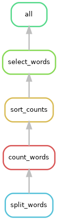
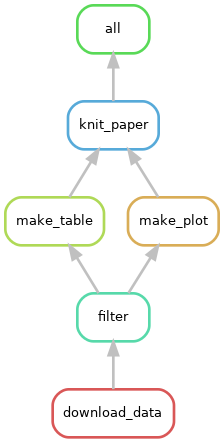
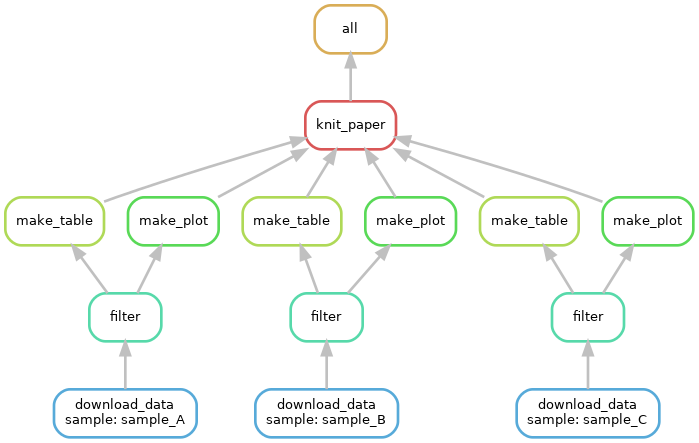

<style type="text/css">
body{ /* Normal  */
      font-size: 14pt;
  }
pre {
  font-size: 12pt
}

.wrapper { overflow-x: auto; }
.wrapper table { white-space: nowrap; }

</style>

By the end of this module, we will:

* List the some advantages of a robust workflow automation solution like Snakemake.
* Describe the fundamental relationship between Snakemake, a Snakefile, and the file system.
* Describe key parts of a Snakemake rule.
* Build a Snakefile and use Snakemake to automate a simple workflow.
* Use wildcards to easily extend a workflow to new inputs.
* Show a Snakemake dry-run and other ways to visualize the workflow.


## What is Snakemake?

Snakemake is a python program that interprets a text file describing your
workflow against the file system and uses rules in that workflow to transform
inputs into outputs as necessary. Snakemake is essentially **declarative**
meaning that you don't tell it what to do, you simply ask for the final output
and Snakemake figures out what it needs to do. That declarative pattern supports
several key attributes:

- Snakemake workflows can gracefully extend to new inputs.
- Snakemake is modular.
- Snakemake is portable.
- Snakemake is “durable” (i.e it crashes with poise).
- Snakemake is efficient.


## Build a Snakefile

A Snakefile is a text file that decribes your workflow. It is interpreted by the
`snakemake` command. Building a good Snakefile is the key step in understanding
Snakemake, so we'll begin there.

### Consider a sample bash script

To build a Snakefile it's helpful to use a concrete example and also helpful to
adapt an existing script. The script below considers the 1868 novel "Little
Women", by Louisa May Alcott. It outputs a file containing the ranked name
counts for each of the four March sisters: Amy, Beth, Jo, and Laurie. (It
also emits a few intermediate files).


<table class='fig'><tr><th class='fig' colspan="2">alcott_script/alcott_script.sh</th></tr>
<tr>
<td class='fig'></td>
<td class='fig'><pre>
#!/bin/bash
# Which of the March sisters is referred to most often in
# part 1 of the Little Women?

# Split lines into words
cat inputs/little_women_part_1.txt \
    | tr -cs '[:alpha:]' '\n' \
    > 1.split_words.txt

# Count words
sort 1.split_words.txt | uniq -c \
    > 2.count_words.txt

# Sort words by descending count and add header
sort -k1,1nr 2.count_words.txt \
    | awk 'BEGIN {print "word\tcount"} { print $2 "\t" $1}' \
    > 3.sort_counts.txt

# Select names with respective counts
egrep '^(Jo|Amy|Laurie|Beth)\s' 3.sort_counts.txt > 4.select_words.txt
</pre></td>
</tr></table>
<br/>


It's not necessary to understand the command in detail, but it is helpful to 
consider the steps with their various outputs:


<table class='fig'><tr><th class='fig'>Inputs, steps, and outputs</th></tr>
<tr><td class='fig'>inputs/little_women_part_1.txt</td></tr>
<tr><td class='fig'><pre>
CHAPTER ONE

PLAYING PILGRIMS

"Christmas won't be Christmas without any presents," grumbled Jo, lying
on the rug.

"It's so dreadful to be poor!" sighed Meg, looking down at her old
dress.
...
</pre></td></tr>
<tr><td class='fig'>1.split_words.txt</td></tr>
<tr><td class='fig'><pre>CHAPTER
ONE
PLAYING
PILGRIMS
Christmas
won
t
be
Christmas
without
</pre></td></tr>
<tr><td class='fig'>2.count_words.txt</td></tr>
<tr><td class='fig'><pre>
   1992 a
     75 A
      1 aback
      1 abase
      3 abashed
      1 abed
      1 abject
      3 able
      3 abominable
      1 abominably
</pre></td></tr>
<tr><td class='fig'>3.sort_counts.txt</td></tr>
<tr><td class='fig'><pre>
word	count
and	3811
the	3303
to	2303
a	1992
I	1988
her	1660
of	1490
in	1094
you	1010
</pre></td></tr>
<tr><td class='fig'>4.select_words.txt</td></tr>
<tr><td class='fig'><pre>
Jo	737
Laurie	319
Beth	294
Amy	283
</pre></td></tr>
</table>
<br/>


To view the results interactively, you can execute the script.

```sh
export WORKSHOP_HOME="/nfs/turbo/umms-bioinf-wkshp/workshop/home/${USER}"
cd $WORKSHOP_HOME/project_alcott/alcott_script

./alcott_script.sh
```

And view excepts of the results in `less`. (Hit `q` key to exit `less`.)

```sh
head inputs/little_women_part_1.txt *.txt | less
```

### Snakemake and the Snakefile

Switch to the alcott_snakemake dir; note there are inputs and a Snakefile
```sh
cd $WORKSHOP_HOME/project_alcott/alcott_snakemake
tree
```
> ```
.
├── inputs
│   ├── little_women_part_1.txt
│   └── little_women_part_2.txt
└── workflow
    └── Snakefile
  ```


A Snakefile is a simple markdown file.By convention, the
snakefile is named `Snakefile` and lives in the `workflow` sub-directory. 
The current Snakefile is simply a stub based on the earlier bash script:

<table class='fig'><tr><th class='fig'>workflow/Snakefile</th></tr>
<tr><td class='fig'><pre>
# split_lines ###########################################################
#cat inputs/little_women_part_1.txt \
#    | tr -cs '[:alpha:]' '\n' \
#    > 1.split_words.txt
# count_words ###########################################################
#sort 1.split_words.txt | uniq -c \
#    > 2.count_words.txt
## sort_count ###########################################################
#sort -k1,1nr 2.count_words.txt \
#    | awk 'BEGIN {print "word\tcount"} { print $2 "\t" $1}' \
#    > 3.sort_counts.txt
# select_words ##########################################################
#egrep '^(Jo|Amy|Laurie|Beth)\s' 3.sort_counts.txt > 4.select_words.txt
</pre></td></tr></table>


A snakefile is composed of rules; each rule has a name and specifies directives such as

- input (what the rule requires)
- output (what the rule promises to generate)
- shell (how it will make input into output)

We add the first step in the workflow as a new rule. (Adding below the existing
comment block.) Note that we will keep the input files and result files in 
separate directories.

```
rule split_words:
    input: "inputs/little_women_part_1.txt"
    output: "results/little_women_part_1.split_words.txt" 
    shell: "cat inputs/little_women_part_1.txt | tr -cs '[:alpha:]' '\n' > results/little_women_part_1.split_words.txt"
```

### Running Snakemake

- The **snakemake** python program interprets the Snakefile and executes rules as 
appropriate to produce the expected output. 
- The snakemake program is installed as a module on Great Lakes.
- When launching snakemake, You specify the number of cores (i.e. CPUs) with the
-c flag. We will use 1 core.

```sh
module load snakemake
module list
# confirm you are in the right working directory
tree
```

> ```sh=
Currently Loaded Modules:
  1) python3.10-anaconda/2023.03   2) snakemake/7.32.4
$ tree
.
├── inputs
│   ├── little_women_part_1.txt
│   └── little_women_part_2.txt
└── workflow
    └── Snakefile
  ```


Run `snakemake` command as below. Note:

- `snakemake` will look for a Snakefile in the workflow directory.
- `snakemake` emits a log to the screen that include 
  - run details
  - Job stats
  - Rule details
  - Completion status i.e. (100%) done

```
snakemake -c1
```


> ```
    Building DAG of jobs...
    Using shell: /usr/bin/bash
    Provided cores: 1 (use --cores to define parallelism)
    Rules claiming more threads will be scaled down.
    Job stats:
    job            count
    -----------  -------
    split_words        1
    total              1
    .
    Select jobs to execute...
    .
    [Mon Jun 10 18:35:41 2024]
    rule split_words:
        input: inputs/little_women_part_1.txt
        output: results/little_women_part_1.split_words.txt
        jobid: 0
        reason: Missing output files: results/little_women_part_1.split_words.txt
        resources: tmpdir=/tmp
    .
    [Mon Jun 10 18:35:41 2024]
    Finished job 0.
    1 of 1 steps (100%) done
    Complete log: .snakemake/log/2024-06-10T183541.204636.snakemake.log
  ```

Check the file system. Note new results/ dir and new file. Note that `snakemake`
created the results/ dir automatically.

```sh
tree
```

> ```
.
├── inputs
│   ├── little_women_part_1.txt
│   └── little_women_part_2.txt
├── results
│   └── little_women_part_1.split_words.txt
└── workflow
    └── Snakefile
  ```

Also note that `snakemake` creates a hidden directory `.snakemake/` in the working 
directory. This holds various info that help snakemake manage the workflow. It's
extremely rare for you to need to examine the contents of the `.snakemake/` 
directory, but FYI.

If you re-run `snakemake` it determines the filesystem is up to date and no 
rules need to be triggered.

```sh
snakemake -c1
```

> ```
Building DAG of jobs...
Nothing to be done (all requested files are present and up to date).
Complete log: .snakemake/log/2024-06-10T184850.944535.snakemake.log
  ```


### Add a new rule

In the Snakemake file, add the second step as a new rule below the first rule.
Note that the inputs of this rule match the outputs of the prior rule.

```
rule count_words:
    input: "results/little_women_part_1.split_words.txt"
    output: "results/little_women_part_1.count_words.txt"
    shell: "sort results/little_women_part_1.split_words.txt | uniq -c > results/little_women_part_1.count_words.txt"
```

By default, `snakemake` only runs the first rule in the Snakefile. To trigger 
the new rule, you can specify the desired end target on the command line.

```sh
snakemake -c1 count_words
```

Note the log output similar to above, but now shows the new rule.

> ```
Building DAG of jobs...
Using shell: /usr/bin/bash
Provided cores: 1 (use --cores to define parallelism)
Rules claiming more threads will be scaled down.
Job stats:
job            count
-----------  -------
count_words        1
total              1
.
Select jobs to execute...
.
[Mon Jun 10 18:52:07 2024]
rule count_words:
    input: results/little_women_part_1.split_words.txt
    output: results/little_women_part_1.count_words.txt
    jobid: 0
    reason: Missing output files: results/little_women_part_1.count_words.txt
    resources: tmpdir=/tmp
.
[Mon Jun 10 18:52:08 2024]
Finished job 0.
1 of 1 steps (100%) done
Complete log: .snakemake/log/2024-06-10T185207.598695.snakemake.log
  ```

See the new file and review the contents:

```sh
head results/*
```

> ```
==> results/little_women_part1.count_words.txt <==
   1992 a
     75 A
      1 aback
      1 abase
      3 abashed
      1 abed
      1 abject
      3 able
      3 abominable
      1 abominably
.
==> results/little_women_part_1.split_words.txt <==
CHAPTER
ONE
PLAYING
PILGRIMS
Christmas
won
t
be
Christmas
without
  ```

### Variables / Rule ordering

Each rule defines **input** and **output** variables; you can use those values
in the **shell** directive:

```
rule split_words:
    input: "inputs/little_women_part_1.txt"
    output: "results/little_women_part_1.split_words.txt"
    shell: "cat {input} | tr -cs '[:alpha:]' '\n' > {output}"

rule count_words:
    input: "results/little_women_part_1.split_words.txt"
    output: "results/little_women_part1.count_words.txt"
    shell: "sort {input} | uniq -c > {output}"
```

Snakemake doesn't care what order the rules appear in the Snakefile but it 
assumes the first rule is the default target. Put the last step of the workflow 
at the top of the file and `snakemake` will default to running the whole workflow.

```
rule count_words:
    input: "results/little_women_part_1.split_words.txt"
    output: "results/little_women_part1.count_words.txt"
    shell: "sort {input} | uniq -c > {output}"

rule split_words:
    input: "inputs/little_women_part_1.txt"
    output: "results/little_women_part_1.split_words.txt"
    shell: "cat {input} | tr -cs '[:alpha:]' '\n' > {output}"
```

Rerun after making these changes, and check out the log (excepted below).

  - Note that in **Job stats** all rules are triggered.
  - Note the value of reason in each of the rules. Does the reason make sense?

```sh
snakemake -c1
```

> ```
...
Job stats:
job            count
-----------  -------
count_words        1
split_words        1
total              2
...
rule split_words:
    input: inputs/little_women_part_1.txt
    output: results/little_women_part_1.split_words.txt
    jobid: 1
    reason: Code has changed since last execution
    resources: tmpdir=/tmp
...
rule count_words:
    input: results/little_women_part_1.split_words.txt
    output: results/little_women_part1.count_words.txt
    jobid: 0
    reason: Input files updated by another job: results/little_women_part_1.split_words.txt
    resources: tmpdir=/tmp
  ```


### Using triple quotes / Escaping curly braces

Add the third step of the transform

- Place it **above** the existing rules.
- Use {input} and {output} variables.
- We use triple quotes to make multiline shell commands.
- In the shell, any braces ({}) related to the command must be doubled to 
distinguish them from Snakefile variables.

```
rule sort_counts:
    input: "results/little_women_part_1.count_words.txt"
    output: "results/little_women_part_1.sort_counts.txt"
    shell: """
	sort -k1,1nr {input} \
	    | awk 'BEGIN {{print "word\tcount"}} {{ print $2 "\t" $1}}' \
            > {output}
        """
```

Note that when you run `snakemake` it only generates the files it needs to.

```sh
snakemake -c1
```

> ```
...
Job stats:
job            count
-----------  -------
sort_counts        1
total              1
...
rule sort_counts:
    input: results/little_women_part_1.count_words.txt
    output: results/little_women_part_1.sort_counts.txt
    jobid: 0
    reason: Missing output files: results/little_women_part_1.sort_counts.txt
    resources: tmpdir=/tmp
...
1 of 1 steps (100%) done
  ```
Use triple quotes to create multiline shell commands. If your commands use curly braces ({}) you need to double them so snakemake doesn't get confused.

### Snakemake dry-run / Interpreting rule errors

Add the fourth rule, placing it above the prior.

```
rule select_words:
    input: "results/little_women_part_1.sort_counts.txt"
    output: "results/little_women_part_1.select_words.txt"
    shell: "egrep '^(Jo|Amy|Laurie|Beth)\s' {input} > {output}"
```

You probably have noticed that `snakemake` will only run the rules it needs to, 
based on changes in files or scripts or missing files. You can preview what 
`snakemake` will do by using the dry-run flag `--dry-run` or `-n`. This will
show the typical snakemake output but will not change any files.

```sh
snakemake -c1 --dry-run
```

> ```
Building DAG of jobs...
Job stats:
job             count
------------  -------
select_words        1
total               1
.
[Mon Jun 10 19:41:43 2024]
rule select_words:
    input: results/little_women_part_1.sort_counts.txt
    output: results/little_women_part_1.select_words.txt
    jobid: 0
    reason: Missing output files: results/little_women_part_1.select_words.txt
    resources: tmpdir=/tmp
.
Job stats:
job             count
------------  -------
select_words        1
total               1
.
Reasons:
    (check individual jobs above for details)
    missing output files:
        select_words
.
This was a dry-run (flag -n). The order of jobs does not reflect the order of execution.
  ```

Developing a Snakefile typically involves some troubleshooting along the way.
I've intentionally introduced a typo in the Snakefile and then did a dry-run to
show an Snakefile error message:

> ```
$ snakemake -c1 --dry-run
.
A  Building DAG of jobs...
B  MissingInputException in rule select_words in file .../Snakefile, line 15:
C  Missing input files for rule select_words:
D    output: results/little_women_part_1.select_words.txt
E    affected files:
F        result/little_women_part_1.sort_counts.txt
  ```

Note:

- B line number (line 15) 
- C Missing input files for rule select_words
- E & F result/little_women_part_1.sort_counts.txt

Can you see the error? You will likely need to consider the rule in context:

```
rule select_words:
    input: "result/little_women_part_1.sort_counts.txt"
    output: "results/little_women_part_1.select_words.txt"
    shell: "egrep '^(Jo|Amy|Laurie|Beth)\s' {input} > {output}"

rule sort_counts:
    input: "results/little_women_part_1.count_words.txt"
    output: "results/little_women_part_1.sort_counts.txt"
    shell: """
	sort -k1,1nr {input} \
	    | awk 'BEGIN {{print "word\tcount"}} {{ print $2 "\t" $1}}' \
            > {output}
        """
rule count_words:
    input: "results/little_women_part_1.split_words.txt"
    output: "results/little_women_part_1.count_words.txt"
    shell: "sort {input} | uniq -c > {output}"

rule split_words:
    input: "inputs/little_women_part_1.txt"
    output: "results/little_women_part_1.split_words.txt"
    shell: "cat {input} | tr -cs '[:alpha:]' '\n' > {output}"
```

Fix the typo and confirm the fix using `--dry-run` to get a clean output. Then
execute `snakemake` normally until you are 100% done. 

### Visualizing the DAG / rulegraph

In addition to doing a dry run, `snakemake` can generate a diagram of the rules
to execute. Snakemake thinks of the rules as a [Directed Acyclic
Graph](https://en.wikipedia.org/wiki/Directed_acyclic_graph){target="_blank"}
(DAG). You can see this with the `--dag` flag and the `dot` program (part of
[Graphviz](https://graphviz.org/){target="_blank"}, an open source graph
visualizer).

```sh
snakemake --dag | dot -Tpng > dag.png
```


<br/>

As you can see above, by default `dot` displays the graphs vertically with inputs
at the top and  outputs at the bottom. Our Snakefile is arranged from 
output to input, so you can invert the diagram like so:

```sh
snakemake --dag | dot -Grankdir="BT" -Tpng > dag_inverted.png
```


<br/>

### All target / Wildcards / Visualizaing the rulegraph

To emphasize the endpoint of the workflow and also clarify the default target,
it's common to place a "rule all" at the top of the file. (This also allows you
to reorder rules within the file arbitrarily.) It is unusual in that it only has
an input directive.

```
rule all:
    input: "results/little_women_part_1.select_words.txt"
```

Snakemake *wildcards* make it easy to to extend the workflow to new inputs. (And
they typically reduce repetition of file names.) Here is an excerpt of the 
Snakefile showing the original **select_words** rule and the same rule with 
wildcards.

```
rule all:
    input: "results/little_women_part_1.select_words.txt"

# original rule
# rule select_words:
#    input: "result/little_women_part_1.sort_counts.txt"
#    output: "results/little_women_part_1.select_words.txt"
#    shell: "egrep '^(Jo|Amy|Laurie|Beth)\s' {input} > {output}"

# now with wildcards
rule select_words:
    input: "result/{base_name}.sort_counts.txt"
    output: "results/{base_name}.select_words.txt"
    shell: "egrep '^(Jo|Amy|Laurie|Beth)\s' {input} > {output}"

```
How does this work?

- The **all** rule needs an input named "results/little_women_part_1.select_words.txt"
- The **select_words** rule can produce "results/{base_name}.select_words.txt" which would match the **all** input if the wildcard *{base_name}*="little_women_part_1"
- In **select_word** input, the rule substitutes the *{base_name}* value for it's wildcard, making "result/little_women_part_1.sort_counts.txt"
- So the the value of the wildcard is determined by the file name in the all rule and that value propagates from output to input.

What happens if we run snakemake?

```sh
snakemake -c1 --dry-run
```

> ```
Building DAG of jobs...
Nothing to be done (all requested files are present and up to date).
  ```

And that actually makes sense: even though we used wildcards, the rules ended up
with identical input and output values.

We can extend wildcards across remaining rules as below. Note that we need to 
keep the literal value in the **all** rule so the other rules can derive the
value of the wildcard.

```
rule all:
    input: "results/little_women_part_1.select_words.txt"

rule select_words:
    input: "results/{base_name}.sort_counts.txt"
    output: "results/{base_name}.select_words.txt"
    shell: "egrep '^(Jo|Amy|Laurie|Beth)\s' {input} > {output}"

rule sort_counts:
    input: "results/{base_name}.count_words.txt"
    output: "results/{base_name}.sort_counts.txt"
    shell: """
	sort -k1,1nr {input} \
	    | awk 'BEGIN {{print "word\tcount"}} {{ print $2 "\t" $1}}' \
            > {output}
        """
rule count_words:
    input: "results/{base_name}.split_words.txt"
    output: "results/{base_name}.count_words.txt"
    shell: "sort {input} | uniq -c > {output}"

rule split_words:
    input: "inputs/{base_name}.txt"
    output: "results/{base_name}.split_words.txt"
    shell: "cat {input} | tr -cs '[:alpha:]' '\n' > {output}"
```

Now that the Snakefile is using wildcards, it is trivial to extend it to new 
inputs. We adjust the **all** rule adding a second value, separated by a comma:

```
rule all:
    input: "results/little_women_part_1.select_words.txt", "results/little_women_part_2.select_words.txt"
...
```

The addition of a new wildcard value (little_women_part_2) will trigger all five
rules.

```sh
snakemake --dry-run
```

> ```
...
Job stats:
job             count
------------  -------
all                 1
count_words         1
select_words        1
sort_counts         1
split_words         1
total               5
...
  ```

Before we run this for real, let's add a new flag `--forceall` to tell snakemake
to trigger every single rule for all possible inputs. Basically act like there 
are no existing outputs and it needs to start from scratch. But this is still
a dry-run, so no files will be changed.

```sh
snakemake --dry-run --forceall
```

> ```
...
Job stats:
job             count
------------  -------
all                 1
count_words         2
select_words        2
sort_counts         2
split_words         2
total               9
...
  ```

Try generating a DAG visualization. (Now it's truly looking more like a 
graph.) Note:

- Each wildcard value gets it's own path
- The wildcard values are displayed at the input
- Some box outlines are solid and other are dotted; why is that?

```sh
snakemake --dag | dot -Grankdir="BT" -Tpng > dag_inverted_wildcards.png
```


<br/>

With complex workflows, you sometimes don't want to see all the possible inputs 
and would rather just see the abstract relationship of the rules. Snakemake
supports this with a related flag `--rulegraph`

```sh
snakemake --rulegraph | dot -Grankdir="BT" -Tpng > rulegraph.png
```


<br/>


Ok. Go ahead and run `snakemake` until you are 100% complete and see these files in 
results:

> ```
$ ls results
little_women_part_1.count_words.txt   little_women_part_2.count_words.txt
little_women_part_1.select_words.txt  little_women_part_2.select_words.txt
little_women_part_1.sort_counts.txt   little_women_part_2.sort_counts.txt
little_women_part_1.split_words.txt   little_women_part_2.split_words.txt
  ```


### The expand function / config files / parameters

Ideally, a workflow could be run on a new set of inputs without changing the
Snakefile at all. For example, we should be able to use our unmodified Snakefile 
with the input of of Shakespeare's [Romeo and
Juliet](https://www.gutenberg.org/ebooks/1513) to see whether Montague is
mentioned more than Capulet. Most of the rules in the workflow are already 
general enough; but there are two exceptions:

- The **all** rule mentions specific texts.
- The **select_words** rule mentions specific names.

We can extract these specifics from the Snakefile using a 
*configuration file*. We'll start with the **select_words** rule.


```
rule select_words:
    input: "results/{base_name}.sort_counts.txt"
    output: "results/{base_name}.select_words.txt"
    shell: "egrep '^(Jo|Amy|Laurie|Beth)\s' {input} > {output}"
```

Firstly, we'll pull the regular expression out of the shell directive into a
[configuration
file](https://snakemake.readthedocs.io/en/stable/snakefiles/configuration.html#configuration){target="_blank"}.
Snakemake supports several styles of configuration file; we'll use the YAML
syntax. By convention we'll create config/config.yaml; you could create and edit
this file manually; alternatively you can also execute the line below:

```sh
mkdir config
echo 'select_words_regex: ^(Jo|Amy|Laurie|Beth)\s' > config/config.yaml
cat config/config.yaml
```

Now add this line above the **all** rule:

```
configfile: "config/config.yaml"
```

Add a parameter initialized to the config key *select_words_regex*. Then adjust
the select_words rule to refernce that parameter.

```
rule select_words:
    input: "results/{base_name}.sort_counts.txt"
    output: "results/{base_name}.select_words.txt"
    params: regex=config[select_words_regex]
    shell: "egrep '{params.regex}' {input} > {output}"
```

The [params
directive](https://snakemake.readthedocs.io/en/stable/snakefiles/rules.html#non-file-parameters-for-rules){target="_blank"}
is a way of adjusting the shell command with a value that isn't tied to the
filesystem. Also note that params can be named (e.g. `x="value"`) and referenced
by name in the shell (`{params.x}`).

Now that we've made this change, let's dry-run snakemake. Note we're adding the
`-p` flag so snakemake will print out the actual commands it will execute:

```sh
snakemake --dry-run -p
```

In the output, note:

- In Job stats, we see snakemake believes we need to rerun **select_words** for both inputs.
- In the rule details, the reason the rule is triggered is that code and params have changed
- Because we used `-p`, you can see the actual egrep statement (which looks fine).

> ```
Building DAG of jobs...
Job stats:
job             count
------------  -------
all                 1
select_words        2
total               3
.
[Mon Jun 10 23:01:21 2024]
rule select_words:
    input: results/little_women_part_1.sort_counts.txt
    output: results/little_women_part_1.select_words.txt
    jobid: 1
    reason: Code has changed since last execution; Params have changed since last execution
    wildcards: base_name=little_women_part_1
    resources: tmpdir=/tmp
.
egrep '^(Jo|Amy|Laurie|Beth)\s' results/little_women_part_1.sort_counts.txt > results/little_women_part_1.select_words.txt
.
[Mon Jun 10 23:01:21 2024]
rule select_words:
    input: results/little_women_part_2.sort_counts.txt
    output: results/little_women_part_2.select_words.txt
    jobid: 5
    reason: Code has changed since last execution; Params have changed since last execution
    wildcards: base_name=little_women_part_2
    resources: tmpdir=/tmp
.
egrep '^(Jo|Amy|Laurie|Beth)\s' results/little_women_part_2.sort_counts.txt > results/little_women_part_2.select_words.txt
...
  ```
  
Go ahead and run snakemake until 100% done.

Now we'll pull the file base names from the **all** rule into the config file:

```
select_words_regex: ^(Jo|Amy|Laurie|Beth)\s

input_base_filenames:
  - little_women_part_1
  - little_women_part_2
```

To get these values from config.yaml into the
**all** rule, I need to introduce the `expand` function.
[expand](https://snakemake.readthedocs.io/en/stable/snakefiles/rules.html#the-expand-function){target="_blank"}
is a helper function that comes with Snakemake. It's easier to explain if we
show a few examples of inputs and outputs:

> ```
expand("{dataset}/a.txt", dataset=[1, 2])
['1/a.txt', '2/a.txt', '3/a.txt']
.
expand("{a}.{b}", a=['fig1', 'fig2', 'fig3'], b=['png', 'pdf'])
['fig1.png', 'fig1.pdf', 'fig2.png', 'fig2.pdf', 'fig3.png', 'fig3.pdf']
.
expand("results/{x}.select_words.txt", \
...         x=["little_women_part_1", "little_women_part_2"])
['results/little_women_part_1.select_words.txt', 'results/little_women_part_2.select_words.txt']
  ```

`expand` accepts a string pattern with named placeholders (e.g. {dataset}) and
named lists (e.g. dataset=[1, 2]); it builds a list of strings by inserting the
list values into the pattern.

That last example above is exactly what we need in the **all** rule. The final 
step is to adapt the example above to use the config file, like so:

```
rule all:
    input: expand("results/{x}.select_words.txt", \
        x=config['input_base_filenames'])
```

The Snakefile is now free of any references to specific inputs. The workflow
can be run on a different set of inputs by using a new config.yaml.

```
configfile: "config/config.yaml"

rule all:
    input: expand("results/{x}.select_words.txt", \
    x=config['input_base_filenames'])


rule select_words:
    input: "results/{base_name}.sort_counts.txt"
    output: "results/{base_name}.select_words.txt"
    params: regex=config["select_words_regex"]
    shell: "egrep '{params.regex}' {input} > {output}"

rule sort_counts:
    input: "results/{base_name}.count_words.txt"
    output: "results/{base_name}.sort_counts.txt"
    shell: """
	sort -k1,1nr {input} \
	    | awk 'BEGIN {{print "word\tcount"}} {{ print $2 "\t" $1}}' \
            > {output}
        """
rule count_words:
    input: "results/{base_name}.split_words.txt"
    output: "results/{base_name}.count_words.txt"
    shell: "sort {input} | uniq -c > {output}"

rule split_words:
    input: "inputs/{base_name}.txt"
    output: "results/{base_name}.split_words.txt"
    shell: "cat {input} | tr -cs '[:alpha:]' '\n' > {output}"

```

---


### Snakemake on Great Lakes


All this time we've been executing the workflow on the login-nodes. It's
generally fine to execute the `snakemake` process itself on the login-node, but
for a more demanding workflow you should execute the rules on Great Lakes worker
nodes.

It's straightforward to do this by using a profile. A profile is essentially
just a little config file that tells `snakemake` how it should submit rules as
jobs. Check out snakemake docs for details on
[profile](https://snakemake.readthedocs.io/en/stable/executing/cli.html#profiles){target="_blank"}
options. We'll start with a simple profile built for Great Lakes:

```sh
cp -r /nfs/turbo/umms-bioinf-wkshp/workshop/shared-data/profile/ config/
```
<div class="wrapper">
<table class='fig'><tr><th class='fig' style="text-align: left">config/profile/config.yaml</th></tr>
<tr><td class='fig'><pre>
printshellcmds: True
keep-going: True
use-singularity: True
singularity-args: "--cleanenv -B $(pwd)"
cluster: sbatch --job-name=alcott_{rule}_{wildcards} --account=bioinf_wkshp_class --partition=standard --nodes=1 --cpus-per-task={resources.cpus} --mem={resources.mem_mb} --time={resources.time_min} --output=cluster_logs/%x-%j.log --parsable
default-resources: [cpus=1, mem_mb=2000, time_min=120]
rerun-triggers: [mtime]
latency-wait: 300
jobs: 5
</pre></td></tr></table>
</div>
<br/>

Invoking `snakemake` with this profile submits each rule a an sbatch job:

```sh
# clear out existing files so there's something to do
rm results/*

snakemake --profile config/profile
```

Note that you can adjust the SLURM job geometry by adding a *resources* directive
to a rule. These values will be incorporated into the sbatch request for this
rule.

```
rule select_words:
    input: "results/{base_name}.sort_counts.txt"
    output: "results/{base_name}.select_words.txt"
    resources: cpus=4, mem_mb=4000, time_min=5  
    params: regex=config["select_words_regex"]
    shell: "egrep '{params.regex}' {input} > {output} #--fake-num-threads={resources.cpus}"
```
<br/>

### Using tmux

[tmux](https://en.wikipedia.org/wiki/Tmux) is a unix utility that let's you 
create virtual screens inside of a single session. (It's like the Unix utility 
*screen*, but more powerful and current.) For our purposes, the killer feature 
of tmux is captured in this simple vignette:

- login to great lakes and start a tmux session on the login-node: `tmux`
- start a long running task (e.g. a snakemake workflow which submits to the cluster)
- detach from that tmux session: hit `ctrl-b` `d`
- turn off your computer, go home, and login to great lakes from different computer
- reattach to that tmux session: `tmux attach`
- you will see your long-running task has been running all along, completely unaffected by your wanderings

And in fact, tmux can actually do much, much more. Here's a nifty [cheatsheet](https://opensource.com/sites/default/files/gated-content/osdc_cheatsheet-tmux-2021.6.25.pdf){target="_blank"}.

If you start using tmux, keep in mind that when you login into
`greatlakes.arc-ts.umich.edu` it's actually forwarding you on to one of *three*
login nodes: gl-login1, gl-login2, or gl-login3. (Which one you get is basically
random.) This means if you want to reconnect to a detached tmux session, you 
have to get to the right login node.

So, if you start a tmux session, note which login node you are using using the 
`hostname` command:

> ```
$ hostname
gl-login2.arc-ts.umich.edu
  ```

Then when you need to later reconnect to that session, instead of `ssh
greatlakes.arc-ts.umich.edu` you connect to the specific hostname you got above:

> ```
ssh gl-login2.arc-ts.umich.edu
# login + Duo
# login banner (blah blah blah)
[cgates@gl-login2 ~]$ tmux ls # list active tmux sessions
0: 1 windows (created Tue Jun 11 20:31:03 2024) [133x25]
[cgates@gl-login2 ~]$ tmux attach # attach to my session
  ```

Voila. You are back in your tmux session, right where you left it.

Lastly, the scrollbar in the terminal/command window does not work in tmux. If
you need to scroll in tmux, you can hit `ctrl`-``b` and then `[` to enter scroll
mode. You can then use cursor or `page-up`, `page-down` to move around the tmux
scroll-buffer. Hit `q` to quit scoll mode and return to the current prompt.

---

## Pro tips

1. Start learning Snakemake with a simple workflow. Don't start with a really
   complex workflow.
2. It's ok to build your Snakefile from the first steps toward the last,
   but remember that Snakemake "thinks" from the last output backward.
3. Keep your inputs, outputs, and workflow in separate directories.
4. Build your Snakefile incrementally.
   a) Start with a single input.
   b) Add a rule at a time.
   c) Make small changes and  use `dry-run` liberally.
   d) OK to start by hardcoding filenames; put the wildcards in afterward.
5. Keep consistent naming conventions. Including your rule names in your file
   names will help you troubleshoot. Some people include numbers in the file
   names or place different outputs in different directories. Choose a pattern
   that works for you and be consistent.
6. If you subset your input data so that your steps are fast and light, you 
   can prototype the Snakefile on the login-nodes. (But be ready to hit control-C
   if you wander into a computationally intensive step.)
7. Use spaces not tabs.
8. Use config files to avoid hardcoding paths or "magic values" in the Snakefile.
9. Checkout Snakemake's styleguide on [Distribution and Reproducibility](https://snakemake.readthedocs.io/en/stable/snakefiles/deployment.html#distribution-and-reproducibility). 
   It has great recommendations on how to organize files and directories.

---

## Key ideas

* A robust workflow automation solution is great because:
  * it supports simple (e.g. linear) and complex (e.g. graph)
    transformations equally well
  * only outstanding steps are run and individual steps are atomic
  * it's designed with software dependency management in mind
  * it's easy to tune, resulting in higher resource efficiency
  * it's portable across execution environments
  * it's designed to gracefully scale to many inputs
  * all the capabilities above don't obscure the actual data transfromation
* Snakemake is a Python program that evaluates the rules in a Snakefile against
  the file system and applies rules as necessary to produce the desired output 
  files.
* The Snakefile is a simple markdown file composed of rules. Each rule contains
  **directives** that specify inputs, outputs, commands to run foe that rule.
* Snakemake builds the intended set of rules into a **directed acyclic graph** 
  (DAG).
* The **dry-run** enables you to see the rules it will execute in advance.
* You can visualize the Snakemake DAG or rulegraph using `dot`.
* Command line flags we reviewed:
  * -c
  * -n --dry-run
  * --dag --rulegraph
  * --forceall
  * -p --printshellcmds

---

## Exercises

### Exercise 1A:

cd to the project publication_snakemake_1

Given this DAG can you fill in the missing parts of the Snakefile below and 
regenerate a similar DAG figure?



FYI:

- All the rules you need are in place, but most of them have incomplete input
and output directives.
- The shell directives in this Snakefile reference "external" scripts
in the workflow scripts directory. You will *not* need to change any shell 
directives for this exercise. 
- The actual results files for this workflow are merely stubs and not interesting. 
Generating the right Snakefile / DAG is the focus.

```
rule all:
    input: 'results/knit_paper.html'

rule knit_paper:
    input: 'inputs/intro.md', ??
    output: ??
    shell: 'workflow/scripts/knit_paper.sh {input} {output}'

rule make_plot:
    input: ??
    output: ??
    shell: 'workflow/scripts/make_plot.sh {input} {output}'

rule make_table:
    input: ??
    output: ??
    shell: 'workflow/scripts/make_table.sh {input} {output}'

rule filter:
    input: ??
    output: ??
    params: chromosome='6'
    shell: 'workflow/scripts/filter.sh {input} {output} {params.chromosome}'

rule download_data:
    input: '/nfs/turbo/umms-bioinf-wkshp/workshop/shared-data/agc-endpoint/0042-WS/sample_A.genome.bam'
    output:
    shell: 'workflow/scripts/download_data.sh {input} {output}'

```

### Exercise 1B:

Use params and a config file to extract hardcoded absolute paths and any other 
"magic values".


### Exercise 1C:

Extend the workflow to cover more inputs as illustrated in the DAG below:




### Exercise 1D:

Copy the profile/config.yaml from project_alcott/alcott_snakemake and force 
re-run the Snakefile using worker nodes instead of the login-node.

---

## References and links:
- https://snakemake.readthedocs.io/en/stable/index.html
  - https://snakemake.readthedocs.io/en/stable/executing/cli.html#all-options
  - https://snakemake.readthedocs.io/en/stable/snakefiles/writing_snakefiles.html#grammar


---

| [Previous lesson](Module06-intro-to-workflow-automation.html) | [Top of this lesson](#top) | [Wrap up](Module99_Wrap_up.html) |
| :--- | :----: | ---: |
