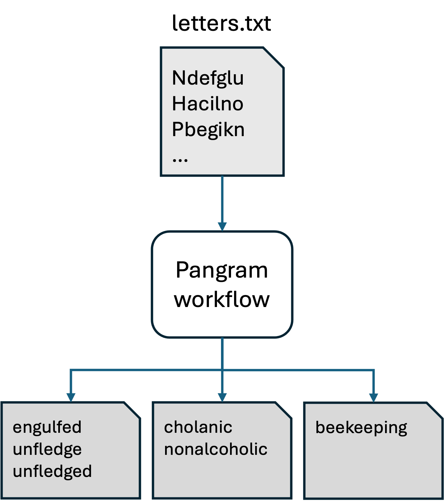
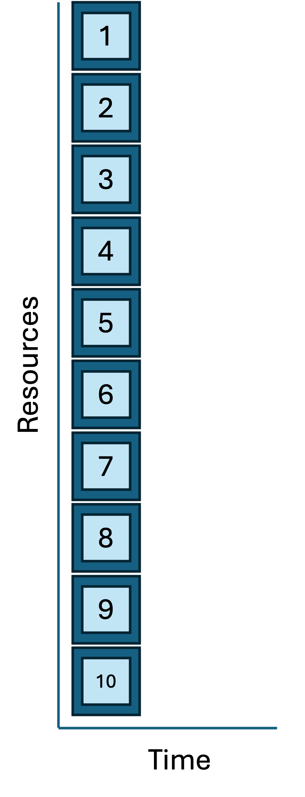

<style type="text/css">
body{ /* Normal  */
      font-size: 14pt;
  }
pre {
  font-size: 12pt
}
table.fig, th.fig, td.fig {
  border: 1px solid black;
  border-collapse: collapse;
  padding: 15px;
}
</style>

By the end of this module, we will:

- Understand what workflow automation is and how it helps reproducibility.
- Review several different ways to execute repetitive tasks on Great Lakes.
- Introduce the idea of job/task geometries to visualize approachs and their advantages and limitations.


## Workflow automation helps reproducibility

Data-intensive research entails transforming raw data into more
meaningful/valuable results. Often, this involves a series of step-wise
transformation tasks. To make this research reproducible by someone else, all the 
transformations must either be documented so that a human can reproduce them, or
automated so a computer can. A reproducible solution has a blend of 
documentation and automation.

Data-intensive research often involves repeating transformation tasks many
times. Also overtime transformations evolve to be more complex, more
computationally demanding, or take longer. A **workflow** describes the key
transformation tasks and their relationships to the inputs and outputs.

**Workflow automation** describes the tools and techniques to systematically
assemble these tasks into a executable, repeatable, robust solution. Building an
automated workflow appears harder than documenting it to be run manually, but
there are many benefits to reproducibility:

  - Automation facilitates repetition.
  - Automation can simplify manual documentation.
  - Automation simplifies validation of your workflow.
  - Automation streamlines sharing.
  - Automation scales to larger inputs

There are many ways to build an automated workflow. In this module we will
consider several ways of executing [pleasingly
parallel](https://en.wikipedia.org/wiki/Embarrassingly_parallel){target="_blank"}
tasks on Great Lakes:

- A serial task loop
- Parallelizing tasks using driver scripts and sbatch files.
- The SLURM Launcher

All these approaches execute the same workflow in different ways. The workflow
produces word pangrams. A **word pangram** is like an anagram that allows
repeating letters, e.g. the sequence of letters ACEHMNT can be rearranged to
create the pangrams ATTACHMENT, CATCHMENT, ENCHANTMENT, and ENHANCEMENT.

The workflow accepts a text file containing list of letter sequences separated
by lines; for each letter sequence it produces a file containing one or more 
pangrams.



<br/>

---

## Pangram: A serial task loop

```r
# Orient on project pangram
cd /nfs/turbo/umms-bioinf-wkshp/workshop/home/$USER
cd project_pangrams
ls -1
```

> ```
pangram_job_launcher
pangram_parallel_sbatch
pangram_serial_loop
README.md
    ```

```r
cd pangram_serial_loop
ls -1
```

> ```
find_pangrams.sbat
find_pangrams.sh
letters.txt
pangram.sh
README.md
  ```

Let's consider a few of these files in turn, starting with the README.

<table class='fig'><tr><th class='fig'>README.md</th></tr>
<tr><td class='fig'><pre>
# pangram_serial_loop

- Produces pangrams for inputs in letters.txt. 
  Makes one file for each line in letters.
- cgates 6/1/2024
- Usage: 
  ./find_pangrams.sh #to run locally
  or
  sbatch find_pangrams.sbat # to submit to worker node

Files:
- find_pangrams.sbat: SLURM batch file; calls find_pangrams.sh
- find_pangrams.sh: Loops throught input and calls pangram.sh
- letters.txt: list of letter sequences seperated by newlines.
- pangram.sh: accepts a single letter sequence and prints all pangrams.
</pre></td></tr></table>
<br/>
<br/>

The pangram.sh script is the workhorse of this workflow. You are welcome to look
at the implementation, but for our purposes we can treat it as a black box.
We'll run it once to see it in action.

```r
./pangram.sh lovely
```

> ```
lovely
lovey
volley
  ```


Consider the input to the workflow:

<table class='fig' width='100%'><tr><th class='fig'>letters.txt</th></tr>
<tr><td class='fig'>
```
Ndefglu
Hacilno
Tdghnou
Nailmpt
Pbegikn
Yacilrt
Achnopy
Uginoqt
Eachkmn
Alhyidn
```
</td></tr></table>
<br/>
<br/>

And finally, the script we will launch to execute the workflow:

<table class='fig' width='100%'><tr><th class='fig'>find_pangrams.sh</th></tr>
<tr><td class='fig'>
```
#/bin/bash
set -eu

for letters in $(cat letters.txt); do
    echo pangrams for: $letters >> /dev/stderr
    ./pangram.sh $letters > results.${letters}.txt
done
echo done >> /dev/stderr
```
</td></tr></table>
<br/>
<br/>

Having reviewed the inputs and scripts, we can launch the workflow like as 
shown below. (This project is called "serial loop" because in this workflow 
we are looping over the inputs and processing one at a time.)

```r
./find_pangrams.sh
```

> ```
pangrams for: Ndefglu
pangrams for: Hacilno
pangrams for: Tdghnou
pangrams for: Nailmpt
pangrams for: Pbegikn
pangrams for: Yacilrt
pangrams for: Achnopy
pangrams for: Uginoqt
pangrams for: Eachkmn
pangrams for: Alhyidn
  ```

We see the results files have been added:

```r
ls
```

> ```
find_pangrams.sbat  results.Achnopy.txt  results.Ndefglu.txt
find_pangrams.sh    results.Alhyidn.txt  results.Pbegikn.txt
letters.txt         results.Eachkmn.txt  results.Tdghnou.txt
pangram.sh          results.Hacilno.txt  results.Uginoqt.txt
README.md           results.Nailmpt.txt  results.Yacilrt.txt
  ```
  
```r
cat results.Achnopy.txt
```
> ```
cacophony
  ```

*Question: Which letter combination generated the most pangrams?*

Let's run it again but instead of using the login-node, we'll submit this to a
worker node using the provided sbat script:

```r
# first clear out the old results
rm results.*
sbatch find_pangrams.sbat 
```

> ```
Submitted batch job 1234567
  ```

Use `squeue -u $USER` to see when the job is finished and then review the 
outputs. We now see the results files and also the slurm log file:

> ```
find_pangrams.sbat   results.Alhyidn.txt  results.Tdghnou.txt
find_pangrams.sh     results.Eachkmn.txt  results.Uginoqt.txt
letters.txt          results.Hacilno.txt  results.Yacilrt.txt
pangram.sh           results.Nailmpt.txt  slurm-1234567.out
README.md            results.Ndefglu.txt
results.Achnopy.txt  results.Pbegikn.txt
  ```

This approach is correct, clear, and reproducible; however it's not ideal.
Consider how the tasks are contained within a job:

<table class='fig' width='100%'><tr><th class='fig'>Job/task geometry of the serial loop approach</th></tr>
<tr><td class='fig'></td></tr>
<tr><td class='fig'>Each sbatch request is a job script; a job script may be
composed of multiple tasks. Key attributes of a **job script** are 

- what sub-tasks will I run?
- how many resources do I need?
- how long will I need to run?

You can represent these graphically by making boxes for each job and their tasks
(height = resource request and length = time). In the case above, there are many
similar tasks contained in a single job. This diagram is a rough representation
of the **job/task geometry**. This is a useful way of visualizing and comparing
approaches; also, the job geometry is critically useful information to the
scheduler which is trying to pack everyone's jobs into the available clusters as
neatly/efficiently as possible.

</td></tr></table>
<br/>

Considering that each of these pangram tasks are completely independent of each
other (i.e. pleasingly parallel). We might be able to make better use of our
~16000 CPUs by parallelizing the workflow. The approaches below show two 
different ways to accomplish this.


<br/>

---

## Pangram: Parallel SBATCH

```r
# Orient on project
cd /nfs/turbo/umms-bioinf-wkshp/workshop/home/$USER
cd project_pangrams/pangram_parallel_sbatch
ls -1
```

> ```
letters.txt
make_sbat_scripts.sh
pangram.sh
README.md
run_sbat_scripts.sh
  ```

<table class='fig'><tr><th class='fig'>README.md</th></tr>
<tr><td class='fig'><pre>
# pangram_parallel_sbatch

- Produces pangrams for letters.txt. Makes one file per line in letters.
- cgates 6/1/2024
- Usage: 
  `./make_sbat_scripts.sh`
  `./run_sbat_scripts.sh`

Files:
- letters.txt: list of letter sequences seperated by newlines.
- pangram.sh: accepts a single letter sequence and prints all pangrams.
- make_sbat_scripts.sh : Build sbat scripts based on letters.txt; 
  for each row in letters.txt adds a new sbat file.
- run_sbat_scripts.sh : Submit all sbat scripts for cluster execution 
</pre></td></tr></table>
<br/>

Executing make_sbat_scripts creates a new directory and adding a collection of 
sbat files.

```r
./make_sbat_scripts.sh 
ls sbat_scripts
```

> ```
...
Achnopy.sbat  Nailmpt.sbat  Uginoqt.sbat
Alhyidn.sbat  Ndefglu.sbat  Yacilrt.sbat
Eachkmn.sbat  Pbegikn.sbat
Hacilno.sbat  Tdghnou.sbat
  ```

Consider a single sbat file.

<table class='fig'><tr><th class='fig'>sbat_scripts/Achnopy.sbat</th></tr>
<tr><td class='fig'><pre>
#!/bin/bash

#SBATCH --job-name=pangram_Achnopy
#SBATCH --cpus-per-task=1
#SBATCH --nodes=1
#SBATCH --ntasks-per-node=1
#SBATCH --mem-per-cpu=400m
#SBATCH --time=00:05:00
#SBATCH --account=bioinf_wkshp_class
#SBATCH --partition=standard
./pangram.sh Achnopy > results.Achnopy.txt
</pre></td></tr></table>
<br/>

Briefly consider the script to see how these sbat files was constructed. Note 
the SLURM preamble directives are integrated into the new files using a 
[HereDoc](https://phoenixnap.com/kb/bash-heredoc){target="_blank"}.

<table class='fig' width="100%"><tr><th class='fig'>make_sbat_scripts.sh</th></tr>
<tr><td class='fig'><pre>
#!/bin/bash
set -eu

mkdir -p sbat_scripts

for letters in $(cat letters.txt); do
    echo sbat for: $letters >> /dev/stderr
    cat << HERE_DOC > sbat_scripts/$letters.sbat
#!/bin/bash

#SBATCH --job-name=pangram_${letters}
#SBATCH --cpus-per-task=1
#SBATCH --nodes=1
#SBATCH --ntasks-per-node=1
#SBATCH --mem-per-cpu=400m
#SBATCH --time=00:05:00
#SBATCH --account=bioinf_wkshp_class
#SBATCH --partition=standard
./pangram.sh $letters > results.${letters}.txt
HERE_DOC
done
echo done >> /dev/stderr
</pre></td></tr></table>
<br/>

We can submit jobs one at a time using sbatch. OR we could build a 
for loop to automate submission; conveniently `run_sbat_scripts.sh` has
done this for us.

<table class='fig' width="100%"><tr><th class='fig'>run_sbat_scripts.sh</th></tr>
<tr><td class='fig'><pre>
for sbat in $(ls sbat_scripts/*.sbat); do 
  sbatch $sbat
done
</pre></td></tr></table>
<br/>

Before we execute `run_sbat_scripts.sh`, you might consider opening a separate 
window to monitor the SLURM job queue. In this second window, you can execute 
`watch squeue -u $USER` to see how the jobs are being scheduled. Hit ctrl-C to 
exit watch. (More info on [watch](https://linux.die.net/man/1/watch).)

```r
./run_sbat_scripts.sh 
```

> ```
Submitted batch job 9289496
Submitted batch job 9289497
Submitted batch job 9289498
Submitted batch job 9289499
Submitted batch job 9289500
Submitted batch job 9289501
Submitted batch job 9289502
Submitted batch job 9289503
Submitted batch job 9289504
Submitted batch job 9289505
  ```

And in a few short seconds, you see the results and SLURM log files. This
approach is correct, more complex than the serial loop, and reproducible. And
because the tasks are working in parallel, it's **much** faster. Contrast this
job/task geometry with the serial loop approach from above:

<table class='fig' width='100%'><tr><th class='fig'>Job/task geometries: serial loop vs parallel sbatch</th></tr>
<tr><td class='fig'></td></tr>
<tr><td class='fig'></td></tr>
</table>

This is great. But there's two to three minor drawbacks to this approach:

- Between the the sbat files, the result files, and the slum log files, it's
created quite a lot more files. They are smallish files, but it's more output to
keep track of.
- When the scheduler is under a heavy load, for very quick jobs (<=60 seconds)
it can take longer to schedule a job than it takes to run the job. In these
circumstances the serial approach might be faster. (If we scaled up from 10 jobs
to 1000 jobs in parallel, we might see this kind of slowdown.)
- Each ARC account has an upper limit on the number of jobs that can be 
submitted and the number actively running. If your account exceeds this limit 
the jobs will start to queue up, awaiting a turn at scheduling and execution. 
That's not a big problem, except for the fact that you share the account with
other users. If you saturate your queue, others will have to wait until your job
finishes before starting theirs. 

To address these concerns, the Texas Advanced Computing Center built a SLURM
tool called [launcher](https://arc.umich.edu/greatlakes/software/launcher/){target="_blank"}
detailed below.

<br/>

---

## Pangram: Launcher

```r
# Orient on project
cd /nfs/turbo/umms-bioinf-wkshp/workshop/home/$USER
cd project_pangrams/pangram_launcher
ls -1
```

> ```
launcher.sbat
letters.txt
make_launcher_tasks.sh
pangram.sh
README.md
  ```

<table class='fig'><tr><th class='fig'>README.md</th></tr>
<tr><td class='fig'><pre>
# pangram_launcher

- Produces pangrams for letters.txt. Makes one file per line in letters.
- cgates 6/1/2024
- Usage: 
  `./make_launcher_tasks.sh`
  `sbatch launcher.sbat`

Files:
- launcher.sbat: sbatch file to start the launcher.
- letters.txt: list of letter sequences seperated by newlines.
- make_launcher_tasks.sh: builds a single file for all tasks to be executed 
  by the launcher.
- pangram.sh: accepts a single letter sequence and prints all pangrams.
</pre></td></tr></table>
<br/>

Run `make_launcher_tasks.sh` and note it creates one new file `launcher_tasks.txt`.

```r
./make_launcher_tasks.sh 
```

<table class='fig'><tr><th class='fig'>launcher_tasks.txt</th></tr>
<tr><td class='fig'><pre>
./pangram.sh Ndefglu > results.Ndefglu.txt
./pangram.sh Hacilno > results.Hacilno.txt
./pangram.sh Tdghnou > results.Tdghnou.txt
./pangram.sh Nailmpt > results.Nailmpt.txt
./pangram.sh Pbegikn > results.Pbegikn.txt
./pangram.sh Yacilrt > results.Yacilrt.txt
./pangram.sh Achnopy > results.Achnopy.txt
./pangram.sh Uginoqt > results.Uginoqt.txt
./pangram.sh Eachkmn > results.Eachkmn.txt
./pangram.sh Alhyidn > results.Alhyidn.txt
</pre></td></tr></table>
<br/>

This might remind you of the serial loop approach, but there's a twist and to 
see it you need to consider the `launcher.sbat` file:

<table class='fig'><tr><th class='fig'>launcher.sbat</th></tr>
<tr><td class='fig'><pre>
#!/bin/bash
#SBATCH --account=bioinf_wkshp_class
#SBATCH --partition=standard
#SBATCH --nodes=1
#SBATCH --ntasks-per-node=5
#SBATCH --cpus-per-task=1
#SBATCH --time=0:30:00

module load launcher
export LAUNCHER_JOB_FILE=launcher_tasks.txt
paramrun
</pre></td></tr>
<tr><td class='fig'>Some details:

- The file starts with a basic SLURM preamble. Note that it's asking for 1 node,
  and 5 CPUs (5 tasks/node * 1 cpu/task) for 30 minutes.
- The last three lines establish that this is a launcher job and the tasks to
  execute live in launcher_tasks.txt.
</td></tr>
</table>
<br/>

Given this setup, sbatch will allocate a node with 5 CPUs for 30 minutes. Then 
the launcher will start looping through the launcher_tasks and as each one
completes it will send another one through until all tasks are complete.

Consider running `watch squeue -u $USER` in another window before you run the 
sbatch command:
```r
sbatch launcher.sbat
```
> ```
Submitted batch job 9290535
  ```

Note that all the tasks are running but they are running "inside"" of the one job.
The job should finish in a few seconds. It will produce the familliar `results.*`
files and also a single SLURM log file which is a bit more interesting than the 
previous log files.

<table class='fig'><tr><th class='fig'>slurm-9290535.out</th></tr>
<tr><td class='fig'><pre class="pre-scrollable">
WARNING (06/09/24 15:38:39): LAUNCHER_WORKDIR variable not set. Using current directory.
windowsP is false
NOTE (06/09/24 15:38:40): Started dynamic task service on port 9471
Launcher: Setup complete.

------------- SUMMARY ---------------
   Number of hosts:    1
   Working directory:  /nfs/turbo/umms-bioinf-wkshp/workshop/home/cgates/project_pangrams/pangram_launcher
   Processes per host: 5
   Total processes:    5
   Total jobs:         10
   Scheduling method:  dynamic

-------------------------------------
Launcher: Starting parallel tasks...
using /tmp/launcher.9290535.hostlist.GYzdOWsB to get hosts
starting job on gl3079
Warning: Permanently added the ED25519 host key for IP address '10.164.8.129' 
 to the list of known hosts.
Launcher: Task 0 running job 1 on gl3079.arc-ts.umich.edu (./pangram.sh Ndefglu > results.Ndefglu.txt)
Launcher: Job 1 completed in 1 seconds.
Launcher: Task 0 running job 2 on gl3079.arc-ts.umich.edu (./pangram.sh Hacilno > results.Hacilno.txt)
Launcher: Task 2 running job 3 on gl3079.arc-ts.umich.edu (./pangram.sh Tdghnou > results.Tdghnou.txt)
Launcher: Job 3 completed in 1 seconds.
...
Launcher: Task 0 done. Exiting.
Launcher: Done. Job exited without errors
</pre></td></tr></table>
<br/>

The launcher solution is correct, clear, and efficient. It is a very nice option
if you have *many* independent tasks that each run quickly (<=60 seconds) and 
each tasks has a modest compute request (e.g. each task needs a single CPU).

<br/>

---

## Geometries and dependencies

<table class='fig' width='100%'><tr><th class='fig'>Job/task geometries compared</th></tr>
<tr><td class='fig'></td></tr>
<tr><td class='fig'></td></tr>
<tr><td class='fig'></td></tr>
</table>

The three job geometries diagrammed above hint that we quietly made a
a few simplifying assumptions along the way:

- We assumed that all the tasks were independent (and thus pleasingly parallel).
- We assumed that all the tasks in a workflow were the same transformation 
applied many different inputs.

Commonly workflows contain several different steps which where the input of one 
step often depends on the output of the previous.
<div style="text-align: center;">

</div>

Also steps in a workflow often have variable resrouce needs and run times:

<div style="text-align: center;">

</div>

Moreover, workflows are not always linear; the logical flow of steps may join the outputs of two steps as an input to a third:
<div style="text-align: center;">

</div>


The techniques we reviewed above are execllent for smaller, simpler workflows, a
more complex, more resource intensive workflow will require either a much more
nuanced set of scripts or a more sophisticated approach altogether. SLURM
supports these more complex scenarios natively with something called job arrays
(see job arrays in [links](#links-and-references) below). In the next module, we
introduce the
**Snakemake** workflow automation framework to address these more complicated
scenarios.

<br/>

---

## Pro tips

Automating workflows is a learning process. Here's a few ideas to consider along
the way:

1. **Do not try to automate something that you cannot do by hand.**
2. **Make it right. Make it clear. Make it efficient. (In that order.)**
3. **Build a README for each workflow.** 
   Consider including:
   - Your name/email
   - The date
   - How to install the workflow
   - How to run the workflow
   - Any necessary context/constraints that would help your future collaborator
     reproduce your results.

4. **Automate the workflow with the data you have.** 
   Don't generalize a workflow too soon. You might see that a workflow could be 
   parameterized/extended to apply to new types of data. Feel that excitement, 
   note the opportunity in the README, and trust that you will make that change
   when you need to.

5. **Instead of developing the whole workflow end to end, consider an iterative and incremental approach.** <br/>

<div style="text-align: center;">

</div>

   Break workflow development into steps:
   
  1) do part of the workflow for one sample and verify correctness as you add
  steps. (For a large dataset consider subsetting/downsampling your inputs so
  you can iterate quicker.)
  2) run a single sample end to end
  3) scale to a few samples and check those outputs; tune resource allocations 
  4) run the whole batch

---

## Exercise: Project Railfence

This project is focused around a transformation that can encode or decode a 
specific kind of encryption called a [rail fence cipher](https://en.wikipedia.org/wiki/Rail_fence_cipher){target="_blank"}. The
details of this encryption are interesting and I encourage you to check out the
link, but for the purposes of this exercise it's ok to treat it as 
magic/black-box transformation.

Review the project directory here:
```sh
cd /nfs/turbo/umms-bioinf-wkshp/workshop/home/$USER
cd project_railfence
ls -1
```

> ```
codes.txt
railfence_decode.py
railfence_encode.py
README.md
  ```


The `railfence_decode.py` script accepts two arguments separated by a comma:

  - a number (a positive integer)
  - a quoted string (the cipher text)

It returns the decoded clear text. You can run the railfence_decode.py script
like so:

```sh
# need to load python once in the session
module load python

./railfence_decode.py 3,"wrivdetceaedsoee-lea ne  crf o!"
```

> ```
we are discovered-flee at once!
  ```

There is a list of encrypted codes in the `codes.txt` file:
<table class='fig'><tr><th class='fig'>codes.txt</th></tr>
<tr><td class='fig'><pre>
2,"onttyt uoaesmtigta o antd yhn"d o r oatmt oehn htyucno ob ad
3,"e hM craifi.nar.mk trgt aei la.Mk tefcet I htodr)aii.kte e in(t e"
4,"aefie aamth klwth ayhvuoetwro htdto et ow au"
5,"rrnmpce eaadeeap"odatt  rn rhniniieictlocs vnaa
3,"t DwieaRAM"r EE
3,"lsie"m!
</pre></td></tr></table>
<br/>

**Your task:**

- Consider the three automation approaches outlined in the lessons above: serial 
loop, parallel batch, and launcher.
- Choose one approach, and, using the patterns above as a template, create
script(s) that will decrypt the codes in `code.txt`.
- If you complete the exercise with a one approach, repeat the
exercise with a different approach.


---

## Key ideas

* Achieving reproducible research requires a blend of documentation and automation.
* Be kind to your future self; they will thank you for the README you left them.
* Automation helps reproducibility:
  * Automation shrinks your README.
  * Automation simplifies validation of your workflow.
  * Automation enables repetition.
  * Automation streamlines sharing.
  * Automation scales to larger inputs
* Job/task geometries help visualize how different approaches are executed. (It 
also hints at the n-dimensional game of Tetris the job-scheduler is playing to
pack everyones jobs as neatly as possible.
* The **SLURM launcher** allows you to gather many parallel tasks into a main job,
  in effect creating a transient sub-cluster within the main HPC.
* For a more complex transformation, ascript can be either simple or
  resource efficient - choose one. Consider more robust solutions (e.g.
  Snakemake) as necessary.

---

## Links and references

- UM ITS docs on [launcher](https://arc.umich.edu/greatlakes/software/launcher/){target="_blank"}
- UM ARC docs on [job arrays](https://docs.support.arc.umich.edu/slurm/array/){target="_blank"}
- SLURM docs on [job arrays](https://slurm.schedmd.com/job_array.html){target="_blank"}
- UM ARC [miVideo](https://www.mivideo.it.umich.edu/media/t/1_z4df84ti/181860561){target="_blank"} on advanced SLURM techniques (including launcher, job arrays, and more)
- For more examples of pangrams in action, checkout:

  - [The New York Times Spelling Bee Puzzle](https://www.nytimes.com/puzzles/spelling-bee){target="_blank"}
  - [Spelling Bee puzzle solver](https://www.sbsolver.com/archive){target="_blank"}

<br/>
<br/>

---

| [Previous lesson](Module05_containers_docker_singularity.html) | [Top of this lesson](#top) | [Next lesson](Module07-intro-to-snakemake.html) |
| :--- | :----: | ---: |
