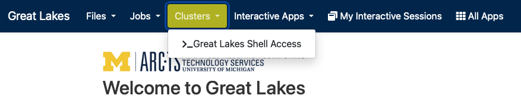

In this module, we will:

* discuss reproducible computing in general
* use a simple warm-up exercise to introduce example data and example tasks
  * we'll expand on this simple analysis/dataset throughout the workshop to demonstrate aspects of reproducible computing
* quickly get started using UMich's Great Lakes High-Performance Computing (HPC) cluster
* start to get acquainted with project organization

 

## Reproducible Computing

Reproducible computing has become increasingly important in recent years. As experimental data volumes have increased exponentially, and as research endeavors have employed more complicated analyses over time, computation has become a fundamental aspect of virtually every type of research.

Reproducibility itself is an integral part of the scientific process. We describe our experiments with sufficient detail so that they can be replicated and our findings can be confirmed by others, and so that eventually others may build upon them.

So taking these two things together, the increasing use of computing in research and the inherent need for reproducibility in the scientific process, we can start to understand the importance of reproducible computing.

There are some challenges we must overcome in this realm. When we try to employ our typical methodologies for general scientific reproducibility, they may not be sufficient to truly enable others to recreate our work. In many cases, in order to credibly validate an analysis, we must be able to not only see and understand the steps of an analysis, but also to use the same software with the same input data and perform these same data manipulations ourselves. Trying to achieve this task with only a descriptive summary of our analysis methods, particularly when using cutting-edge academic software, may often produce little more than frustration.

Let's take a moment to think about our own experiences with this topic. Can we think of experiences where we encountered challenges while trying to reproduce the analysis of others? Or while trying to share our own analyses with colleagues?

There are a number of tools and techniques that have emerged to address some of these challenges, and to really lower the barrier to sharing and reproducing our results.

In this workshop we'll discuss these tools and techniques, we'll provide specific guidance for University of Michigan researchers to address reproducibility concerns, and we'll use practical examples along the way to gain experience and emphasize the concepts that we learn.

 

## Warmup Example - "Hello Alcott"

 

We'll use the text of Louisa May Alcott's novel, "Little Women" as a dataset throughout a good portion of this workshop. As a simple example analysis task, we'll search the text for the mention of several main characters.

 

### Task: Count Mention of Main Characters

 

How many times are each of these main characters mentioned:?

- Amy
- Beth
- Jo
- Laurie
- Meg

 

### Preview of Example Warmup Script

 

We have an example script called `hello_alcott.sh` that we'll use to find the answer to this question. Here is a diagram showing what it does:

 

<!-- LIVE_NOTE: Mention the purpose of these examples - simple dataset is easy to understand and explain - We'll use the example to demonstrate things like project organization, documentation, software management, etc. -->

 

### Quick-Start Great Lakes

 

Sneak preview of the web-based shell

 

## Exercise - Connect with the Web-Based Shell

Following along with the instructor, we'll use the web-based shell to connect to Great Lakes. Once there, we'll run an introductory script, and take another look at our transferred files.

Here is the link to [ARC's Great Lakes Portal](https://greatlakes.arc-ts.umich.edu)

 
 

| [Previous lesson](Module00_Introduction.html) | [Top of this lesson](#top) | [Next lesson](Module_sneak_peek_great_lakes.html) |
| :--- | :----: | ---: |
