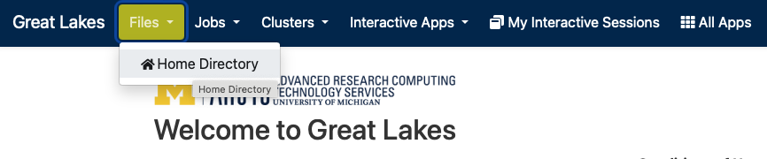
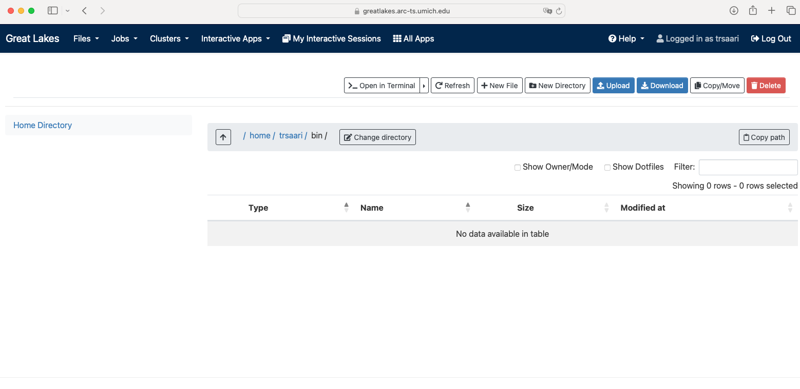
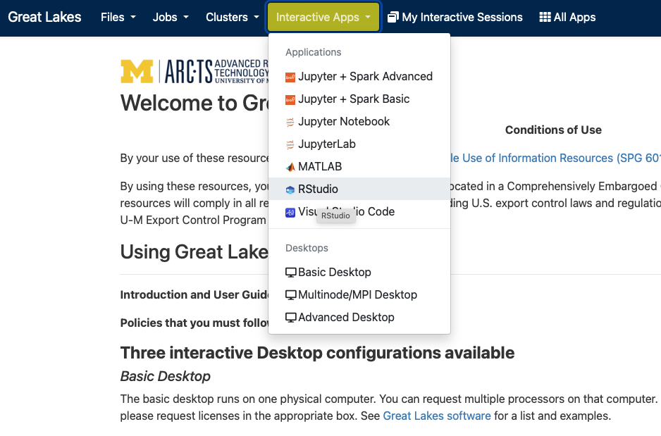
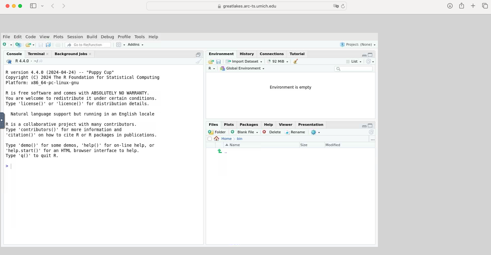
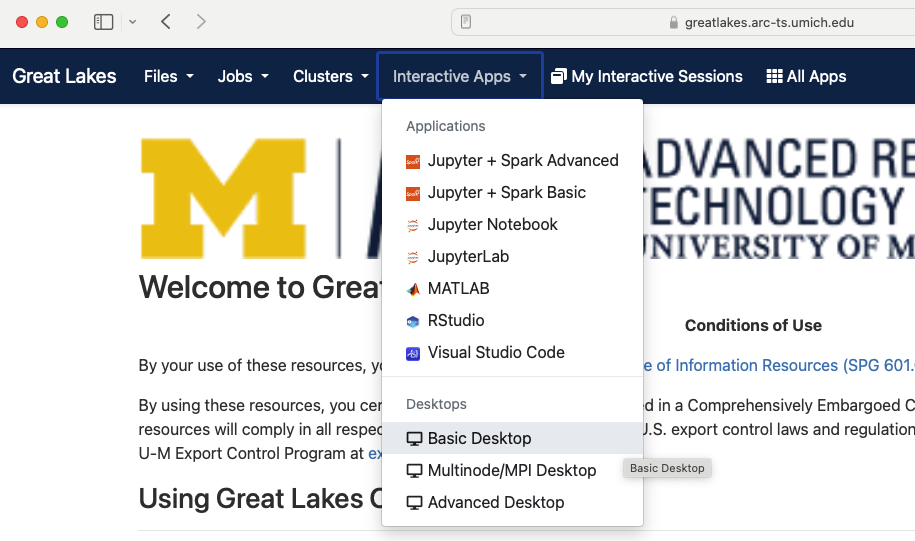

In this module, we will:

* discuss why we must request compute resources for most analysis tasks
* introduce several additional ways of interacting with the Great Lakes HPC cluster
* use the web-based file browser for Great Lakes
* use the OpenOnDemand service to launch a web-based interactive job

 

## Great Lakes - Sneak Peek

So far, we've briefly described Great Lakes as a general-purpose High-Performance Compute (HPC) cluster. 

In this module we'll start to get a feel for what it's like to use an HPC cluster. It's not intended to be a deep dive, but rather to demonstrate/preview some of the quickest ways to get started in order to start gaining experience with this system.

### Using an HPC Cluster - Must Request Resources

When using an HPC cluster, there is a pattern that is quite different from our typical interactions with a computer system - we must ask for resources before we are able to use them. This is a characteristic of a shared, large, multi-user system like Great Lakes. Within the entirety of the system, we have an enormous amount of computing power, but at the same time, we need to allow equal access to this resource to the whole university. Therefore, we use this pattern of requesting resources and receiving them before we begin our computing tasks.

### Several ways to access Great Lakes

- For compute access:
    - Secure Shell (ssh)
    - Web-based shell
    - OpenOnDemand interactive apps (e.g. RStudio, Basic Desktop)
- For file access:
    - Web-based file browser
    - Globus
    - Direct (it's directly connected to Great Lakes)
    - Remote mount (it can be network-connected to your workstation)
    - `scp`, `rsync`, etc.

### Using the web-based access methods

The web-based tools that provide access to Great Lakes and other ARC resources are a quick and easy way to get started. We'll use these in our upcoming exercises to make our first foray into using the Great Lakes HPC. Additionally, the 'Interactive Apps' with ARC's Open On Demand service offer a unique solution for when we need to run graphical applications. We'll preview this and give some practical tips for using the RStudio and the Basic Desktop apps.

 

Sneak preview of the web-based file browser

 

Sneak preview of the web-based shell

 

Sneak preview of a web-based RStudio session

 

Sneak preview of a web-based Basic Desktop session

 

## Handy links for Great Lakes

- [Link to ARC's Great Lakes overview page](https://its.umich.edu/advanced-research-computing/high-performance-computing/great-lakes)
- [Link to Great Lakes Dashboard](https://greatlakes.arc-ts.umich.edu)

 

## Exercise - View Transferred Files

Following along with the instructor, we'll use the web-based file browser to review the files from the hello_alcott.sh warmup exercise

## Exercise - Launch an RStudio Instance on OpenOnDemand

Following along with the instructor, we'll use OpenOnDemand to launch an RStudio instance. Once there, we'll run a basic R script as a quick demonstration of these capabilities.

## Review

- Discussed the importance of requesting resources
- Learned about additional ways of accessing the Great Lakes HPC cluster
- Gained familiarity and experience with some of the the web-based access methods

 

### Handy Links

- [Link to ARC's Great Lakes overview page (same as above)](https://its.umich.edu/advanced-research-computing/high-performance-computing/great-lakes)
- [Link to Great Lakes Dashboard (same as above)](https://greatlakes.arc-ts.umich.edu)
- [link from AGC on validating file integrity using md5sum](http://michmed.org/agc-md5sum)

| [Previous lesson](Module_overview_and_warmup.html) | [Top of this lesson](#top) | [Next lesson](Module_data_priorities_analysis_setup.html) |
| :--- | :----: | ---: |
