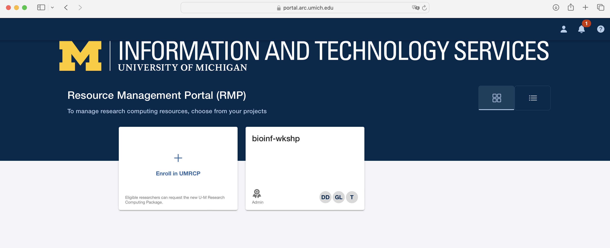

In this module, we will:

* learn about several institutional storage options (and associated compute resources)
* learn about the UMRCP and how to request it
* make a plan for enrolling PIs in UMRCP and enabling access to all researchers

 

## Revisiting Raw Data Considerations

Recommended:

- Designated location for storing raw data
- Limit write access of stored data files
- Use institutional storage
  - Large file sizes and large total allocations
  - Long-term support
  - Hardware redundancy
  - Location redundancy

 

## Storage Options for UMich Researchers

We've discussed best practices for data, analysis intermediates and scripts, etc. in general terms, but now we'll have the opportunity to revisit these ideas while highlighting specific options and recommendations for UMich researchers. By the end of this module, we will understand our numerous storage options available to us. Looking forward to future modules, we'll also run exercises that interact with some of these storage allocations as we proceed, including Data Den and its unique characteristics and usage patterns.

### What is ARC?

The vast majority of computing resources we'll be discussing in the workshop are provided and managed by ARC - Advanced Research Computing at University of Michigan. The shared computing cluster that we'll be using in the workshop is run by ARC, and the storage allocations likewise are provided by ARC. Their mission is to provide university researchers with the advanced computing resources that they need, and they've been working with research groups in various compute intensive fields to achieve this. 

Later in this module we'll discuss in detail how to request resources through ARC, but for now we'll focus on the storage topic and cover some important storage options that ARC provides.

 

### Data Den

Data Den is a low-cost, highly durable storage system operated by ARC.

- Tape-based archival storage
- The largest and most affordable storage available through ARC.
- Can only access this indirectly
  - i.e. use Globus to interface with this storage. 
  
<!-- Due to its architecture, slow speeds, and need to eliminate unnecessary read/write operations -->

> Note: Data Den has a file size limitation - it does not handle large amounts of small files. Optimal file size is in the multi-gigabyte range.
> The limitation 10,000 files per TB of storage.

### Turbo

Turbo is a high-capacity, reliable, and fast storage system operated by ARC. It is more costly than Data Den.

- More costly than Data Den
- Tuned for files moderate to large in size, but can also easily accomodate small files
- Can be accessed through the High-Performance Computing (HPC) cluster

Fast storage like Turbo is well-equipped for computing direcly from it. Turbo supports fast read/write times, and is an excellent place to perform analyses.

### Turbo and Data Den - Cost Difference

We discussed above that Data Den is slow, unsuited for analysis, yet cost-effective, while Turbo is fast, well-tuned for analysis, and more costly. To put some numbers to this price discussion, see the following table of cost per TB per year:

|          | Unreplicated | Replicated |
| --------:| -----------------------:| ----------:|
| Turbo    | $77.88                  | $156.22    |
| Data Den | NA                      | $20.04     |

Notice that Turbo storage is about 8x more costly than Data Den for the same amount of replicated storage.

>Note: Data Den is only available in the replicated format.

<!-- LIVE_NOTE: We'll mention how researchers can get a portion of Turbo and Data Den at no cost to them -->

### Home, Scratch, tmp, and others

- Home directory (80 GB quota)
  - /home/uniqname
- Scratch directory (10 TB and 1,000,000 file quota)
  - /scratch/account_root/account/uniqname
  - Not persistent over time
    - Automatically deleted if not accessed in 60 days
- Local disk (4 TB shared)
  - /tmp
  - Not persistent across machines

### Institutional Storage vs Other Storage

| Institutional | Other |
|:--------------- |:--------------------------------- |
| Turbo           | Laptop Storage                    |
| Data Den        | Storage on a Shared Lab Computer  |
| Home / Scratch* | Portable Hard Drive / Flash Drive |
| MiStorage       | Cloud Storage                     |

 

## UMRCP

The figure above highlights the most important and impressive details of the UMRCP, but you can find full details of the resources offered through this program on [the UMRCP page of ARC's website](https://its.umich.edu/advanced-research-computing/research-computing-package).

### Signing up for the UMRCP

Within that site, there is another page that I highly recommend as a great place to start - the [UMRCP Getting Started Guide](https://its.umich.edu/advanced-research-computing/research-computing-package/getting-started). There you'll find details about the signup process. After signing up, you'll be able to use some of the numerous compute nodes available through ARC, as well as the various storage tiers described above.

 

 

Additional Resources Available Through HITS RCI

In addition to the resources provided through the UMRCP, some researchers within the medical system will have additonal resources available through UM Health Information Technology & Services (HITS). Through strategic investments in High Performance Computing by Michigan Medicine, eligible researchers can enjoy additional allocations for the described resources - most notably unlimited Data Den storage.

In the documentation for the UMRCP and the UMRCI, you'll see that they recommend first using the UMRCP resources (available to all university researchers) and then transitioning to these additional HITS UMRCI resources (available to Michigan Medicine researchers) when possible. In any case, since these allocations are managed by ARC for all univerisity researchers - Michigan Medicne or otherwise - you'll be using the same forms and procedures to request resources and use them. However, the billing details may change depending on this eligibility.

[Link to HITS page on UMRCI](https://hits.medicine.umich.edu/research-education/research-computing-data-storage/research-computing-package)

 

### Great Lakes, Armis2, and Lighthouse Clusters

This module overall is primarily focused on storage-related topics. We've briefly mentioned that in addition to storage resources, ARC also provides access to high-performance computing (HPC) hardware as well. While in this workshop we'll just be focusing on one of them, in fact there are several HPC clusters that are available to UMich researchers, in order to meet various needs.

When discussing research needs, especially in anticipation of requesting UMRCP resources and filling out the required form, we should discuss a little bit about three HPC options provided through ARC:

- Great Lakes
- Armis2 (HIPAA-aligned)
- Lighthouse (Researcher-owned hardware)

We'll be discussing Great Lakes at length throughout this workshop and using it for our example analyses. We can think of it as a general-purpose HPC cluster, which is suitable for many different kinds of research.

Armis2 is similar in feel to the Great Lakes cluster, except it is configured with specific security measures in place to enable analysis of sensitive data, such as export-controlled or HIPAA protected data.  When filling out the UMRCP form, you can make selections for sensitive data needs, which will provide CPU hours on Armis2 and associated storage. We'll see later, that we have flexibility in how we allocate resources between e.g. Great Lakes and Armis2.

>Note: There is a separate, security-enhanced Turbo allocation that is also HIPAA aligned that should be used with Armis2.

Lighthouse is also similar in feel to the Great Lakes cluster, except it is a cluster comprised entirely of researcher-owned hardware. Contrasting this with Great Lakes where we are only responsible for the cost of the resources we use, on Lighthouse, a researcher will fund the entirety of the hardware and receive 100% of its availability. This can be a good choice for researchers who are expected to have near-constant compute usage needs, or who require instant availability of HPC resources.

<!-- LIVE_NOTE: Link to the ITS sensitive data guide, is also available at the "UMRCP Requesting Resources Guide": https://safecomputing.umich.edu/dataguide/?q=home -->

 

Main ideas:

 - PI must be the one to fill out form
 - PI will automatically become an administrator
 - Others can become administrators (lab manager) or members

 

### Administrators vs Users

|              | Change Allocations | Add/Remove Users | Use GL compute time | Read/Write access to Turbo | Globus Admin |
| ------------ |:------------------ |:---------------- |:------------------- |:-------------------------- |:------------- |
| PI           | ✅                  | ✅                | ⏳                   | ⏳                          | ✅             |
| Lab Manager  | ✅                  | ✅                | ⏳                   | ⏳                          | ✅             |
| Grad Student |                    |                  | ✅                   | ✅                          |               |

> Legend:
>
> ✅ = Frequent
>
> ⏳ = Occasional

 

### Resource Management Portal

A key part of how we will manage our ARC resources is through their Resource Management Portal, shown here. 

This portal can be found at [https://portal.arc.umich.edu](https://portal.arc.umich.edu).

Let's not go there just yet, but discuss what we see in this screenshot, and then move on to the exercise. We'll learn about some of the differences that we may see depending on our current status and existing resources, and we'll learn that there are some differences in the best way to request UMRCP resources depending on these details.

 

## Exercise: Make a Game Plan for UMRCP

In this exercise we will determine the needs for UMRCP enrollment by audience & their PIs.

There are two video links below. There's a decent amount of overlap in the content, and the main ideas are pretty similar. In either case, we will be filling out the UMRCP web forms as shown in the videos. Depending on our current status though, we may have different optimal starting points and different things to consider.

<!-- LIVE_NOTE: The main difference is that the web-form for requesting resources can automatically detect some existing resources. In the videos it demonstrates navigating to that form in different ways - that's one thing to pay attention to. There are many possibilities of existing setups, and not everything will be automatically detected -->

 

[UMRCP How to Enroll - New to ARC Services](https://www.mivideo.it.umich.edu/media/t/1_i8j5pujz/181860561)

 

[UMRCP How to Enroll - Existing Owner of ARC Services](https://www.mivideo.it.umich.edu/media/t/1_znf6ygk0/181860561)

 
 

| [Previous lesson](Module_data_priorities_analysis_setup.html) | [Top of this lesson](#top) | [Next lesson](Module_great_lakes_cluster.html) |
| :--- | :----: | ---: |
