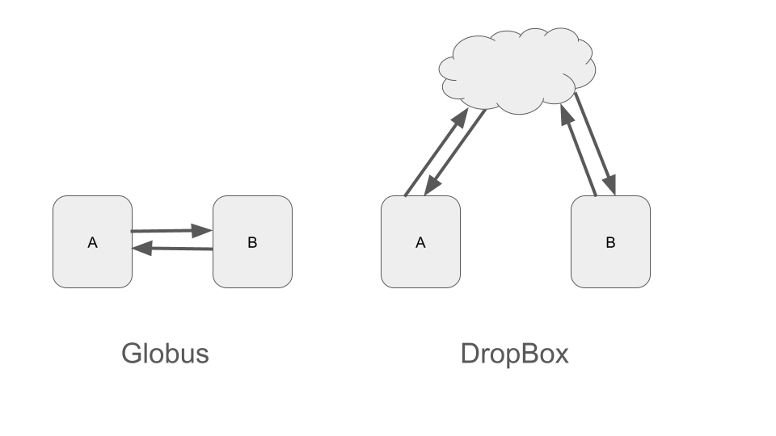
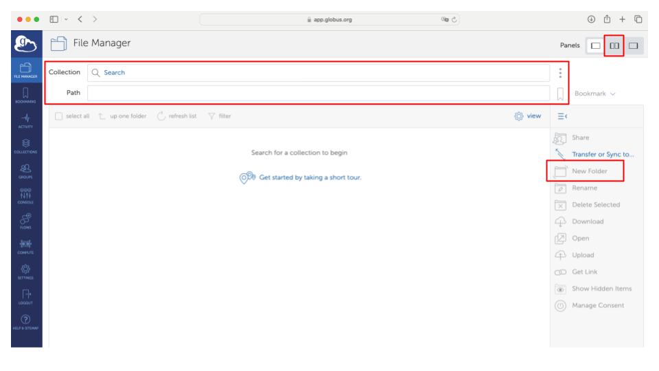
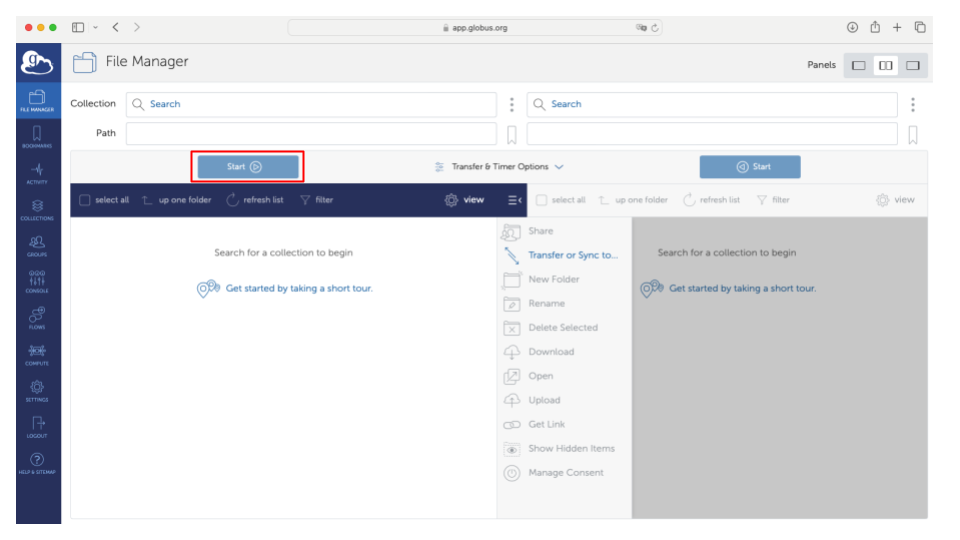
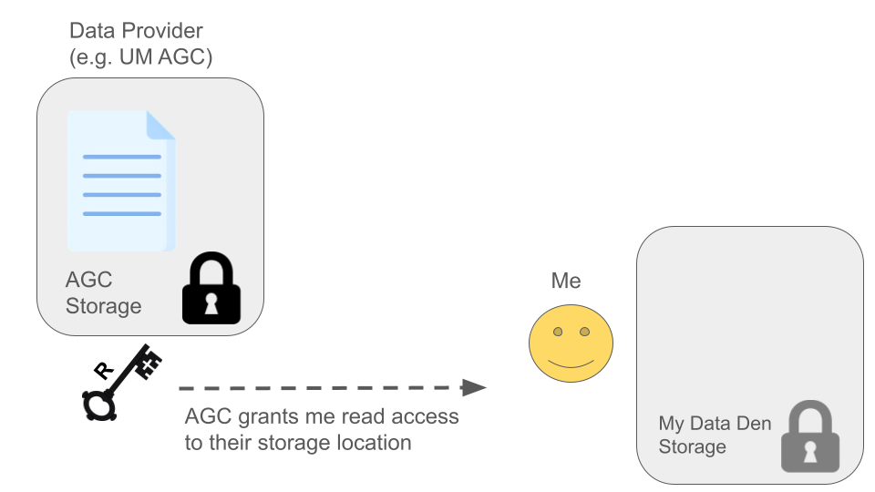
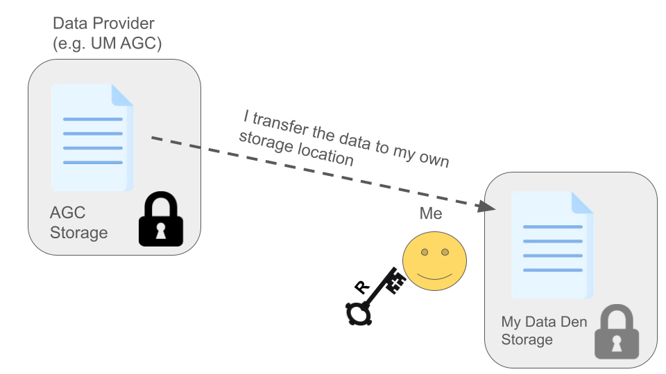
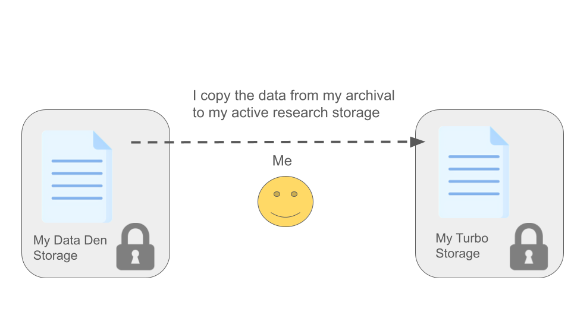
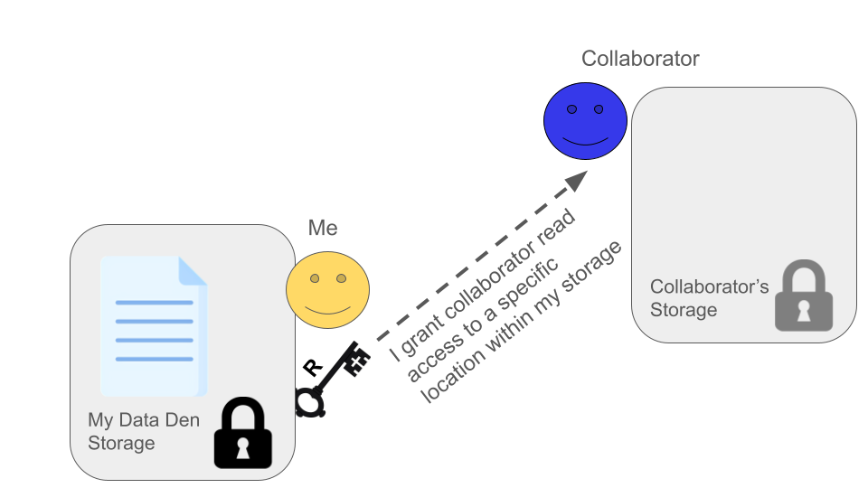
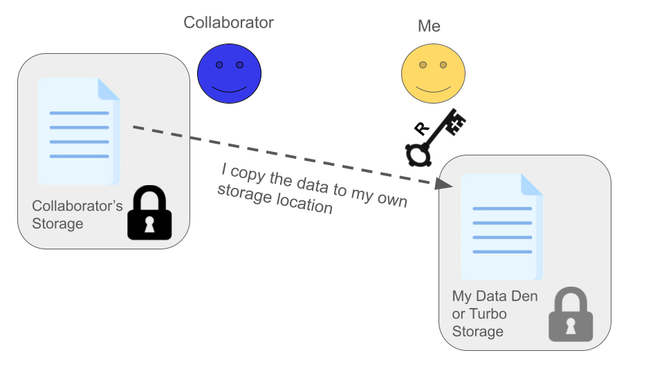

In this module, we will:

* review storage best practices and relate them to real situations
* learn about the data transfer tool Globus
* gain real experience using Globus in various ways

## Relating Data Transfer to Storage Best Practices with Typical Examples

 - I need to retrieve raw data from a data provider, and keep it in a safe place
 - I need to copy my raw data into a new location, to perform an analysis
 - I need to share my raw data and my analysis with a collaborator

## Data Transfer

As you can see, data transfer itself is an important consideration that goes hand in hand with our storage best practices described in the previous module. Ensuring that data is transmitted and received intact, and understanding the movement and placement of data during your research life cycle is a very important aspect of reproducible computing.

## Globus

For the data transfer portion of this workshop, we'll focus on a software solution called Globus. Globus allows the transfer of data between different storage systems, and it's designed particularly for transferring research data. Many universities and institutions, including the University of Michigan, are using Globus in this way.

### What is Globus, and What it Isn't

 

Globus is a software suite for data transfer operations with the following characteristics:

- Fast, with parallelized transfer operations
- Resilient to connectivity problems
  - If any failures occur during transfer, ability to resume
- Fire and forget*
- Highly configurable with fine-tuned access control
- Geared towards research data, particularly where data volumes are very high

Globus is *not* a cloud storage service, in contrast with something like DropBox

 

## Globus Sneak Preview / Orientation

 

 

 

## Exercise Transferring Data from Data Provider to My Data Den

1 | 2
:-------------------------------------------------------------:|:-------------------------------------------------------------:
 | 

## Exercise Transferring Data from My Data Den to My Turbo

1 | 2
:-------------------------------------------------------------:|:-------------------------------------------------------------:
 | 

 
 

### Additional Scenarios

 

Sharing Data with a Collaborator

1 | 2
:-------------------------------------------------------------:|:-------------------------------------------------------------:
 | 

 

 

Data Provider (AGC) 'Pushes' Data to Me

1 | 2
:-------------------------------------------------------------:|:-------------------------------------------------------------:
 | 

Sometimes, if we expect many data deliveries over a period of time, and if we're dealing with an entity that we can trust with write access to our storage location, it may be advantageous to set up an arrangement so that they may transfer the data to us without any action on our part. 

As shown in the figure, we can grant read **and** write access to them, and this enables them to transfer data to us without our involvement. In other words, this allows them to 'push' data to us, without the need for interaction from us.

The Advanced Genomics Core at UMich is increasingly recommending this type of arrangement, especially to researchers who already have Data Den storage allocations through the UMRCP. This is an excellent way to ensure that your data are automatically placed in a good place for long-term archival storage.  

Here is a [link for the AGC data retrieval page which includes the push-to-data-den instructions](https://medresearch.umich.edu/office-research/about-office-research/biomedical-research-core-facilities/advanced-genomics-core/data-retrieval). If you scroll to the bottom of that page, under the "Where to keep your data" heading, there is a drop-down section for "U-M Clients". The instructions therein are the details of how to set up a `push-to-data-den`, where you set up a designated location in your Data Den space and grant permissions for the AGC to write your sequencing data directly to that location.

 

Collaborator Shares Data with Me

1 | 2
:-------------------------------------------------------------:|:-------------------------------------------------------------:
 | 

 

Using Globus Connect Personal to Transfer to/from Non-Institutional Storage

During this workshop, we've emphasized usage of institutional storage allocations like Turbo and Data Den. Our example exercises have also only utilized institutional storage. As discussed, we recommend keeping your data within the institutional storage options if possible, for the redundancy and safety capabilities that they offer. However, there may be situations where you must transfer data to/from non-institutional storage. We can also use the Globus software suite to accomplish this, using a tool called Globus Connect Personal.

It may be easy to forget that Globus is not a Cloud Storage provider while using it. As mentioned, when we're using Globus to transfer data among institutional storage locations, we have always-on, fire-and-forget capabilities that can feel similar to other tools like DropBox. However, this is only possible because UMich (and other research institutions) provide this always-on capability. Essentially, our academic IT provides the constant connection between the Globus software and our institutional storage like Data Den, Turbo, etc. If we want to transfer data to/from non-institutional storage, though, we don't have this luxury.

Globus Connect Personal is an application that you download and install on the computer that holds (or has access to) the data that you want to transfer. For instance, if you have sequencing data stored on the hard-drive of an old laptop (not recommended, but it happens), you would install Globus Connect Personal on that laptop and it could provide the connection between the laptop's hard drive and other Globus-connected storage like the Data Den and Turbo locations we've used above. After installing and configuring this, you could then see (and share, etc.) data from the laptop using the Globus Web App to perform transfers just as we have in the exercises above.

You can find documentation about installing and configuring Globus Connect Personal at [this page on Globus's documentation website](https://docs.globus.org/globus-connect-personal/).

>Note: The computer that's running Globus Connect Personal must remain on and connected to the network for the entire duration of the transfer. Remember that in this case, the Globus Connect Personal software that's running on that computer is what provides the connection to all other Globus-connected storage.

 
 

## Review Main Points

When considering any data transfer, you must understand:

- Where the data currently resides
- Where the data will be transferred to
- Who is responsible for performing the transfer

Unless this is arranged previously for an ongoing relationship, *someone* will *always* need to grant permissions to enable a transfer between two parties.

| [Previous lesson](Module_raw_data_management.html) | [Top of this lesson](#top) | [Next lesson](Module_wrap_up.html) |
| :--- | :----: | ---: |
