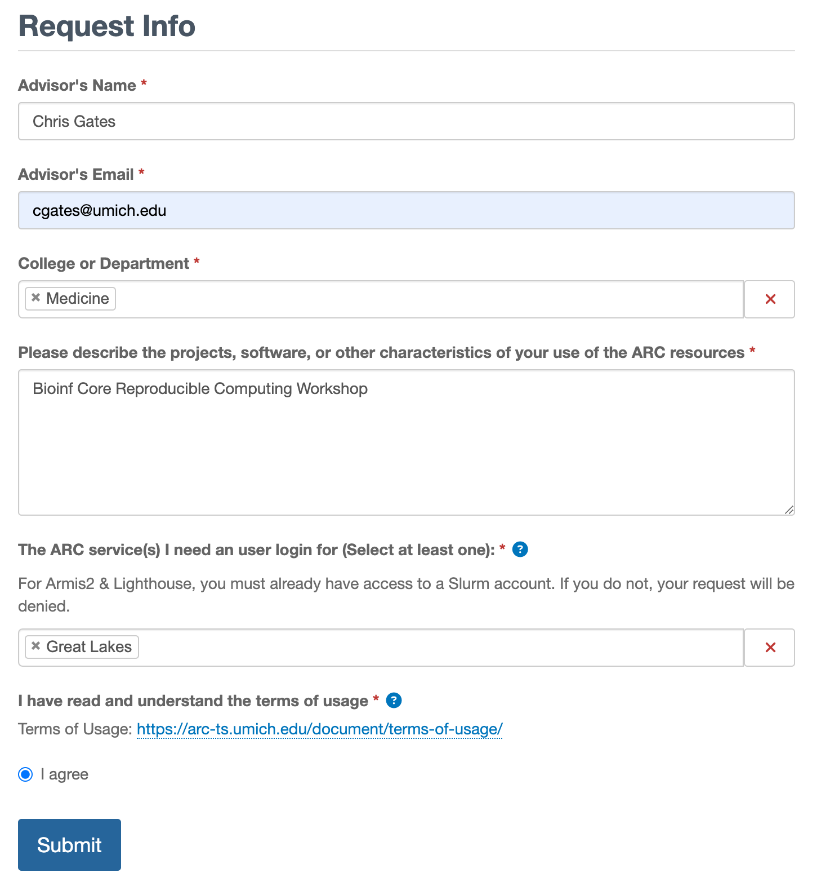
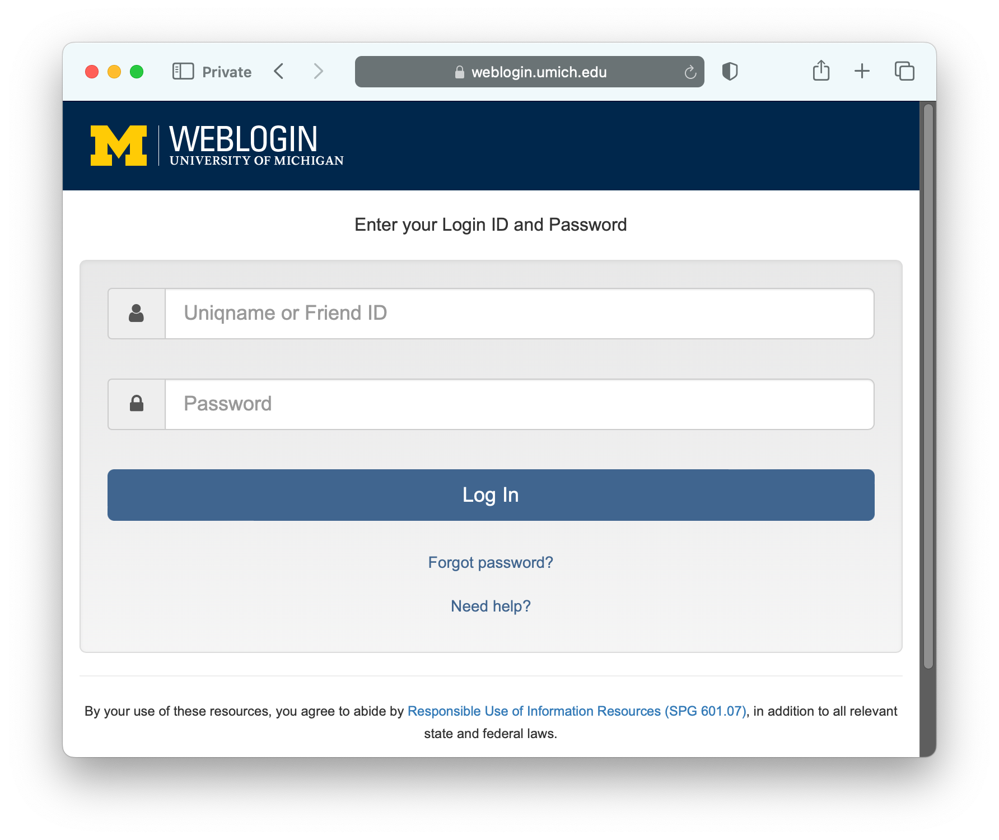
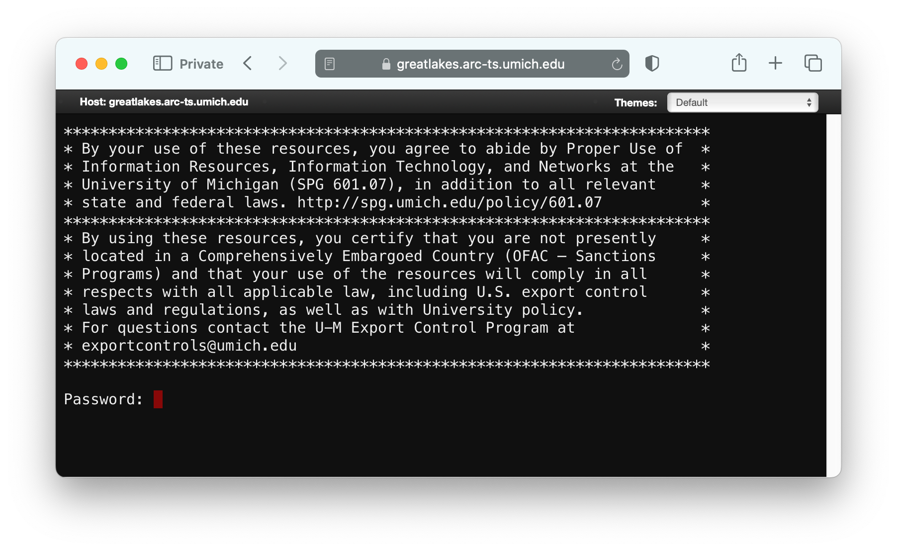
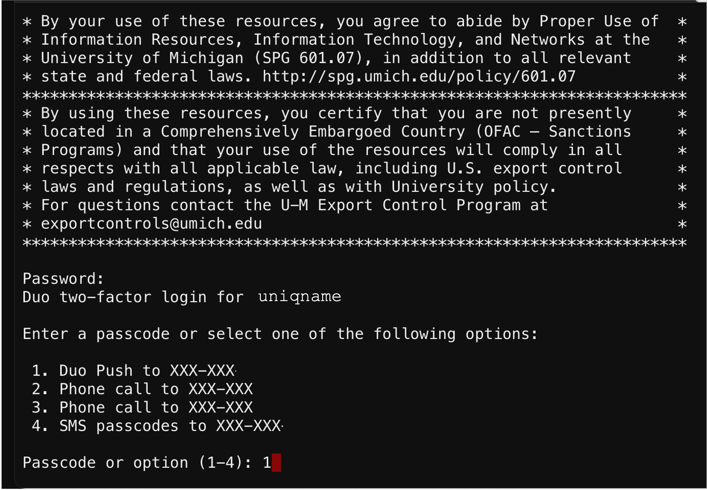
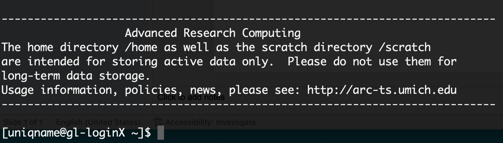

This document guides you through the preliminary steps necessary
to participate in the workshop. To complete
this setup, you will need:

-   A Macintosh or Windows workstation connected to the internet.
-   An email invitation to the workshop Slack workspace.
-   A UM uniqname and password.
-   A Duo app on your smartphone or tablet.
-   About 10 minutes.

## Introduction

-   The virtual workshop will be conducted using Zoom and Slack for all days.
-   Attendees will use their own workstation/laptop to participate; the
    workstation/laptop should have a microphone, camera, and reliable
    internet access. While not required, for laptop users we recommend using a
    larger monitor for the optimal workshop experience.
-   The workshop will use Slack for group messaging. Messages posted to the
    general channel will be visible to all participants in the workshop.
-   We will be using compute and storage provided by UM Advanced Research Computing.
    All required software and data will be pre-installed in a workshop account.

## How to get help

While we have endeavored to make this setup process work robust and
comprehensive, installing bioinformatics software is tricky and we would
be happy to lend a hand to get things working.

-   If you have problems/questions, please don't hesitate to email us
    at:
    [bioinformatics-workshops@umich.edu](mailto:bioinformatics-workshops@umich.edu)

-   When emailing it will speed things along if you could include:
    -   Whether you are using Windows or Mac (and optionally which
        version of the OS you are using).
    -   The specific text of any error messages, if applicable.

## Setup steps

### **1. Zoom**

   If you have not used Zoom before, please use the following link to
   install "Zoom client for Meetings"\
   [https://zoom.us/download](https://zoom.us/download){target="_blank"}

   - Additional Zoom settings for Macintosh:

     1.1  To enable screen sharing (useful for breakout rooms and tech support)

        - System Preferences \>\> Security & Privacy: click on the Privacy tab
        - Select **Screen Recording** on left tab
        - Scroll to the bottom of the right tab and verify **Zoom** is checked.

     1.2.  To enable remote control (useful for breakout rooms and tech support)

        - System Preferences \>\> Security & Privacy: click on the Privacy tab
        - Select **Accessibility** on left tab
        - Scroll to the bottom on the right tab and verify **Zoom** is checked.
        - If it's not checked, click the lower left lock icon and enter
            user password when prompted. You can now check Zoom in the
            right tab.
        - Click the lock again.

      1.3.  Close and relaunch Zoom client.

### **2. Slack**

   2.1. In the Slack email invitation from the hosts, click the link to join the Slack workspace.

   2.2. Follow the Slack instructions to login or create an account. You may
      edit your profile to add a photo if you choose.

   2.3. Note that once your Slack account is established and you have accepted the
      Slack invite you can access the Slack channel by pointing your web browser
      here:  
      [https://umbioinfcoreworkshops.slack.com](https://umbioinfcoreworkshops.slack.com){target="_blank"}

### **3. Install Duo 2-Factor Authentication (2FA)**
   Duo 2FA ensures access to computing resources are secure.
   You can skip this step if you already have Duo installed on your smartphone or tablet.

   3.1 Follow the instructions under "Get Started Now":    
   [https://safecomputing.umich.edu/two-factor-authentication/turn-on-weblogin](https://safecomputing.umich.edu/two-factor-authentication/turn-on-weblogin){target="_blank"}

### **4. Establish a Great Lakes user login**

   If you already have an active Great Lakes user login you can skip to [step 5 below](#step-5).
   (And if you are not sure whether you have a login, you can try step 5 below 
   and come back here if your login fails.)  
   ARC staff typically process these requests very quickly, but it would be 
   diligent to submit this request ASAP.

   4.1 In your browser, go to:  
       [https://arc-ts.umich.edu/login-request](https://arc-ts.umich.edu/login-request){target="_blank"}  
       You may be prompted to login using your uniqname, level-1 password, and 
       Duo 2FA.
   
   4.2 In the form, enter the following information:
   
   - Advisor’s Name: **Chris Gates**
   - Advisor’s Email: **cgates@umich.edu**
   - College or Department: **Medicine**
   - Please describe projects…: **BioinfCore Reproducible Computing Workshop**
   - The ARC services need…: **Great Lakes**
   - Your screen will look something like this:  
     

   4.3 Review and accept the terms of service and submit the request.
   
   You will need to pause here until you receive an email from ARC confirming
   that your account has been created.

### **5. Login to the shared server from your web browser** {#step-5}

   5.1. In your web browser, follow this link:  
        [https://greatlakes.arc-ts.umich.edu/pun/sys/shell/ssh/greatlakes.arc-ts.umich.edu](https://greatlakes.arc-ts.umich.edu/pun/sys/shell/ssh/greatlakes.arc-ts.umich.edu){target="_blank"}

   5.2 The first time you do this, you may see a standard UM Weblogin page 
       (below). Enter your uniqname and level-1 password and click **Log-In**.
       Check your phone/tablet for a Duo 2FA Push notice and Accept.  
       

   5.3 Your browser will update to show a terminal window with a banner showing 
       brief terms of use followed by a password challenge (below). 
       Click in this window to ensure the browser has focus 
       and type your level-1 password followed by the **Enter** or **Return**
       key. 
       __**PLEASE NOTE: the password prompt does not change as you type your
       password - while unsettling, this is ok and it is actually accepting
       your password.**__
       

   5.4 The terminal window inside the browser will prompt for Duo authentication; 
       choose a method and accept the Duo challenge on your phone or tablet.
       

   5.5 The terminal window will update to show welcome text and a command
       prompt. Note that you may see some red text warning about ARC Maintenance
       and your prompt may look slightly different than below; that's ok.
       

   5.6 At the command prompt copy & paste the following command followed by **Enter**/**Return** key 
       `/nfs/turbo/umms-bioinf-wkshp/workshop/bin/setup-complete`

   The command should show a block of text like this:
   
    Thank you for taking the time to setup and test your configution
    in advance of the workshop. We look forward to seeing you soon!

   If you see the text above, you have successfully logged into Great Lakes and
   you are ready for the workshop.

   You can close this window by typing **exit** at the command prompt or simply 
   closing the browser window.

## Congratulations
Your workstation and logins are ready for the workshop; thank you for
   taking time to set this up in advance.

   - You can close the terminal window by typing **exit** **<Return/Enter>** or 
     simply closing the browser tab.

### A note on the shared compute environment

Please note that this workshop environment is optimized for the exercises in this
particular workshop but is likely unsuitable for analyzing your own
datasets. In particular:
- It is not sized for compute intensive operations or large storage.
- It is not secured for sensitive data of any kind.
- Your access to the workshop ARC account is temporary and will be removed 
  shortly after the conclusion of the workshop.

If you had problems or questions about the installation steps
please see the **[How to get help](#how-to-get-help)** section above for
more assistance.
